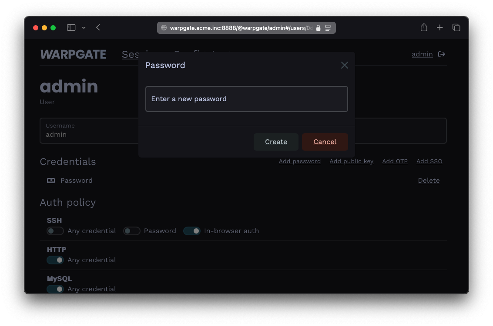
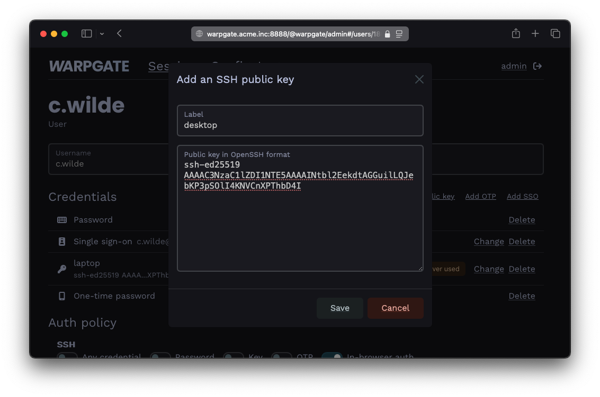
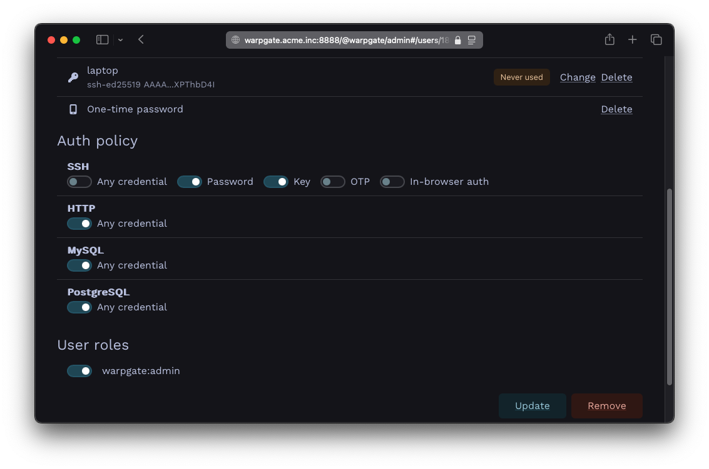

# User authentication and roles

In the [previous example](./targets/ssh.md), we've reused the Warpgate's `admin` user, which only had a password as its only way to authenticate. Warpgate supports passwords, public keys, authenticator apps, SSO (OIDC) and combinations thereof as authentication methods.

## Changing a user's password

Log into the Warpgate admin UI and navigate to `Config` > `Users` > `admin`, delete the old password and click `Add password` to add a new one.


/// caption
Adding a password
///

Users can also manage their own password by clicking their username in the top right corner. This can be globally disabled via `Config` > `Global parameter`.

## Adding a public key for a user

* Grab the user's public key in OpenSSH format (normally, you can just copy the `~/.ssh/id_<type>.pub` file contents), e.g.:

```text
ssh-ed25519 AAAAC...bD4I user@host
```

* Click `Add public key` and paste it:


/// caption
Adding a public key
///

## Requiring multiple authentication factors

Warpgate can require a client to present both a public key and a password.

* In the `Auth policy` > `SSH` section, uncheck `Any credential` and select both `Password` and `Key`:


/// caption
Setting up a multifactor auth policy
///

## Using roles to assign access

You can use _roles_ to grant a new user access to multiple targets at once (or assign multiple users to a target).

* Create and remove roles under `Config` > `Roles`.
* Assign roles to users and targets on their respective configuration pages.
