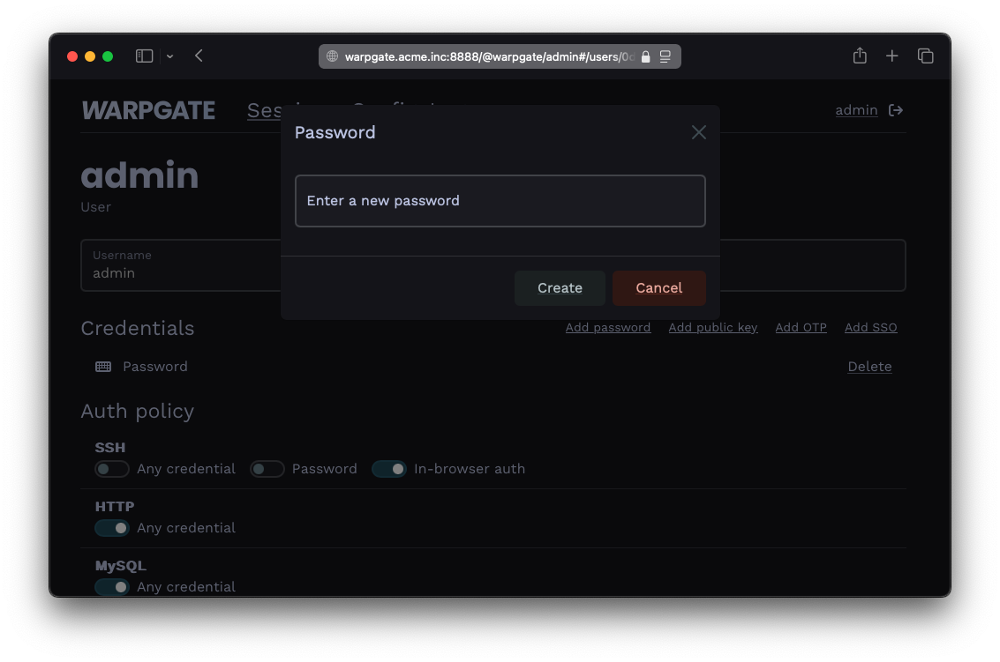
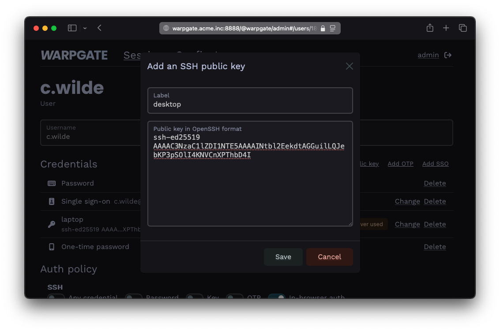
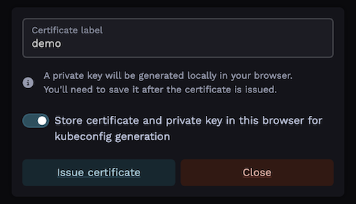
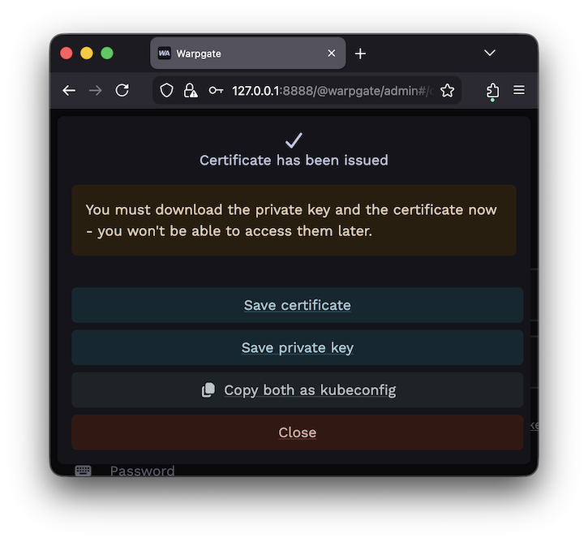
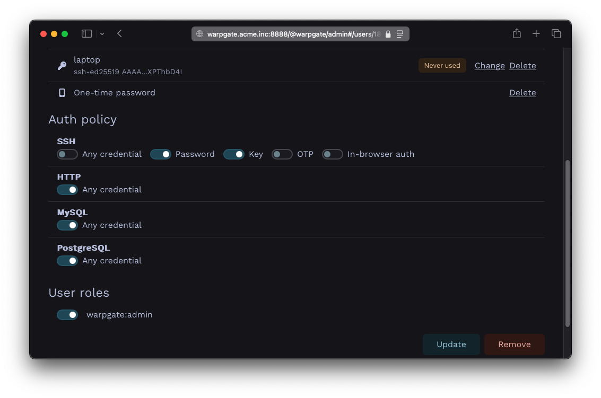
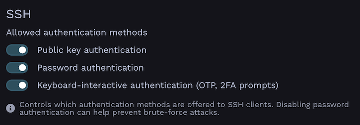

# User authentication

In the [previous example](./targets/ssh.md), we've reused the Warpgate's `admin` user, which only had a password as its only way to authenticate. Warpgate supports passwords, public keys, authenticator apps, SSO (OIDC), API tokens and combinations thereof as authentication methods.

## Changing a user's password

Log into the Warpgate admin UI and navigate to `Config` > `Users` > `admin`, delete the old password and click `Add password` to add a new one.


/// caption
Adding a password
///

Users can also manage their own password by clicking their username in the top right corner. This can be globally disabled via `Config` > `Global parameter`.

## Adding a public key for a user

* Grab the user's public key in OpenSSH format (normally, you can just copy the `~/.ssh/id_<type>.pub` file contents), e.g.:

```text
ssh-ed25519 AAAAC...bD4I user@host
```

* Click `Add public key` and paste it:


/// caption
Adding a public key
///

## Adding a client certificate for a user

<div class="badge font-xs text-bg-warning mb-3">v0.21+</div>

Warpgate supports client certificates for authentication over the [Kubernetes API](./targets/kubernetes.md) protocol.

* Click `Issue certificate` and Warpgate will generate a keypair in-browser and issue a client certificate for the user:


/// caption
Issuing a client certificate
///

Note the option to store the private key in the browser's local storage for later use. This allows the Warpgate frontend to later retrieve the private key to generate a `kubeconfig` file for the user.

* The key must be stored in the same browser that the user will be getting connection instructions on.
* Obviously, do not store the key in an untrusted environment.
* The key is stored in the browser's IndexedDB and can be deleted by "clearing browser data" or similar.
* If the key is not stored at the time of certificate generation, Warpgate will generate a `kubeconfig` with placeholders in it.
* It's not possible to store the private key after the fact; the user will always have an option of simply issuing a new certificate ad-hoc and storing its key (as long as credential self-management is allowed).
* The private key is never sent over the network.


/// caption
Certificate is issued
///

## Requiring multiple authentication factors

Warpgate can require a client to present both a public key and a password.

* In the `Auth policy` > `SSH` section, uncheck `Any credential` and select both `Password` and `Key`:


/// caption
Setting up a multifactor auth policy
///

## SSH client authentication methods

<div class="badge font-xs text-bg-warning mb-3">v0.20+</div>

Warpgate allows you to globally block SSH authentication methods. This can be useful if you exclusively use public key authentication and would like to prevent network scanners from hammering password authentication on a public port. By default, all methods are enabled.

You can disable them individually under `Config` > `Global parameters` > `SSH authentication methods`:


/// caption
SSH authentication methods configuration in Global Parameters
///

## API Tokens

<div class="badge font-xs text-bg-warning mb-3">v0.13+</div>

Warpgate supports API tokens for programmatic access. Users can create and manage their own API tokens through the web interface by clicking their username in the top right corner and navigating to the "API Tokens" section.

Requests made with an API token are considered authenticated in the same way as if the user would have logged in normally.

### Using API Tokens

Pass the token in the `x-warpgate-token` header when making API requests:

```bash
# Example: Get server info
curl -H "x-warpgate-token: xyz" https://warpgate.acme.inc/@warpgate/api/info
```
