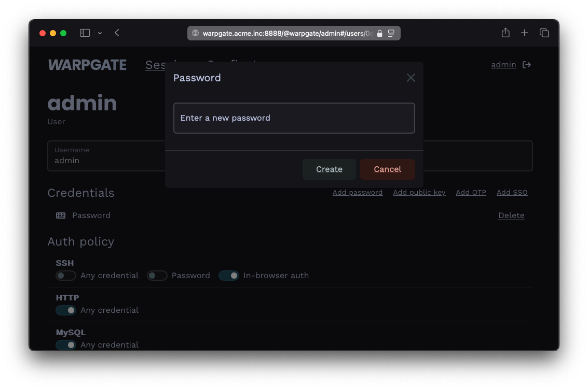
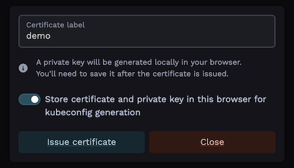
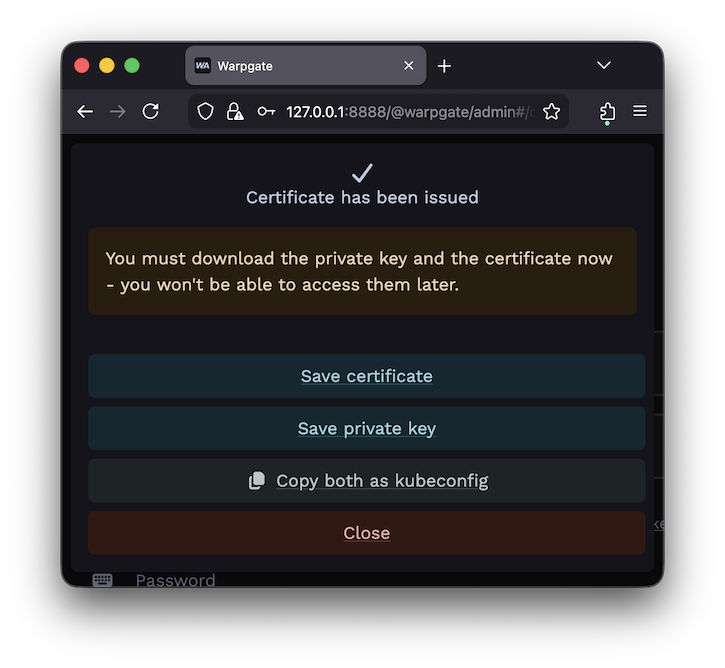
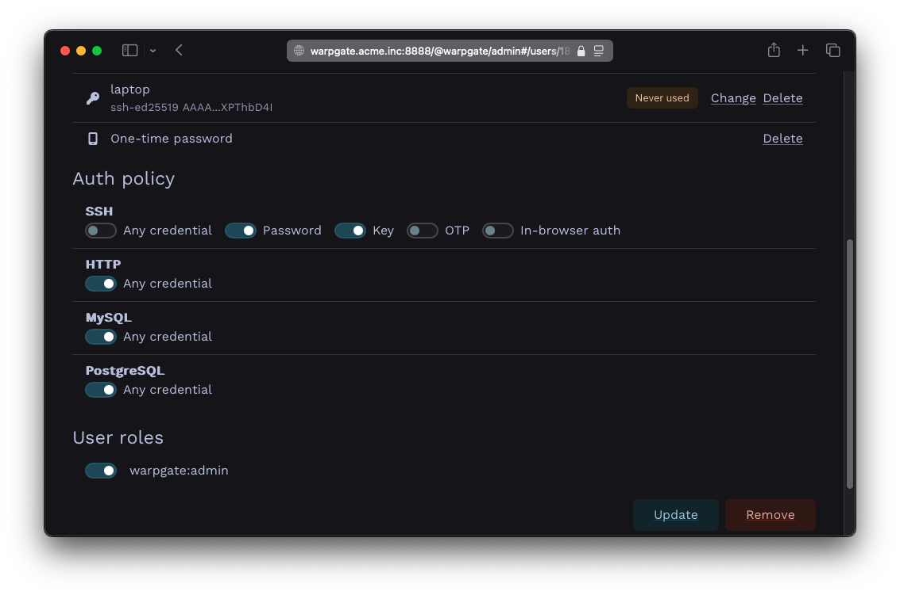
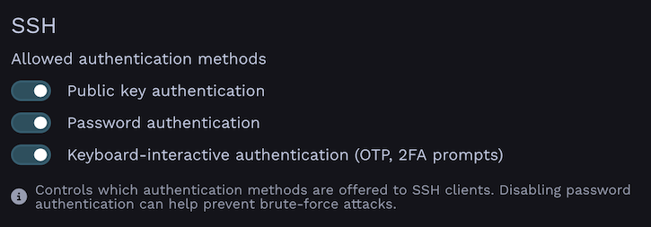
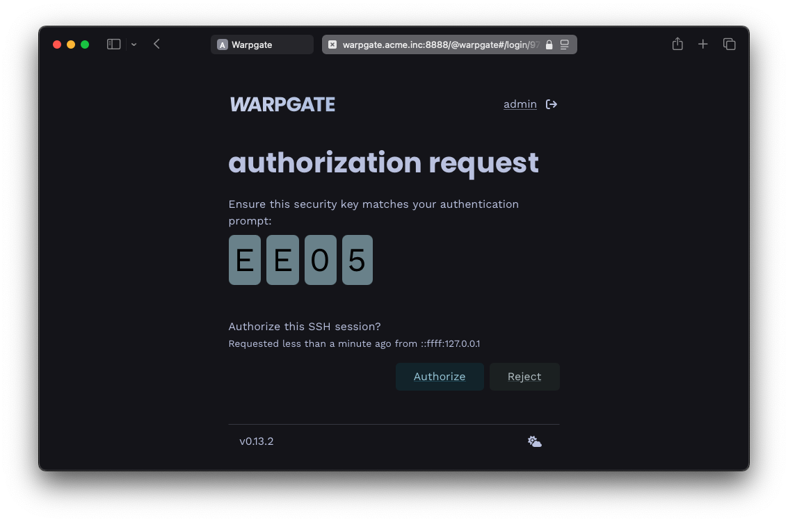

# User authentication

In the [previous example](./targets/ssh.md), we've reused Warpgate's `admin` user, which only had a password as its only way to authenticate. Warpgate supports passwords, public keys, authenticator apps, SSO (OIDC), API tokens and combinations thereof as authentication methods.

## Changing a user's password

Log into the Warpgate admin UI and navigate to `Config` > `Users` > `admin`, delete the old password and click `Add password` to add a new one.


/// caption
Adding a password
///

Users can also manage their own password by clicking their username in the top right corner. This can be globally disabled via `Config` > `Global parameters` > `Credentials`.

## Adding a public key for a user

* Grab the user's public key in OpenSSH format (normally, you can just copy the `~/.ssh/id_<type>.pub` file contents), e.g.:

```text
ssh-ed25519 AAAAC...bD4I user@host
```

* Click `Add public key` and paste it:


/// caption
Adding a public key
///

## Adding a client certificate for a user

<div class="badge font-xs text-bg-warning mb-3">v0.21+</div>

Warpgate supports client certificates for authentication over the [Kubernetes API](./targets/kubernetes.md) protocol.

* Click `Issue certificate` and Warpgate will generate a keypair in-browser and issue a client certificate for the user:


/// caption
Issuing a client certificate
///

Note the option to store the private key in the browser's local storage for later use. This allows the Warpgate frontend to later retrieve the private key to generate a `kubeconfig` file for the user.

* The key must be stored in the same browser that the user will be getting connection instructions on.
* Obviously, do not store the key in an untrusted environment.
* The key is stored in the browser's IndexedDB and can be deleted by "clearing browser data" or similar.
* If the key is not stored at the time of certificate generation, Warpgate will generate a `kubeconfig` with placeholders in it.
* It's not possible to store the private key after the fact; the user will always have an option of simply issuing a new certificate ad-hoc and storing its key (as long as credential self-management is allowed).
* The private key is never sent over the network.


/// caption
Certificate is issued
///

## Requiring multiple authentication factors

Warpgate can require a client to present both a public key and a password.

* In the `Auth policy` > `SSH` section, uncheck `Any credential` and select both `Password` and `Key`:


/// caption
Setting up a multifactor auth policy
///

## Enforcing MFA for everyone

<div class="badge font-xs text-bg-warning mb-3">v0.29+</div>

Instead of editing every user's auth policy, you can require a second factor globally under `Config` > `Global parameters` > `Login` > `MFA enforcement`:

* **Off** - default, per-user auth policies apply as-is.
* **Enroll** - users who log in on the web and do not have an OTP yet are forced to set one up. Once enrolled, their web logins require the OTP. Other protocols are not affected.
* **Require** - above plus every protocol requires a second factor now. SSH, RDP and VNC prompt for the OTP; MySQL, PostgreSQL and Kubernetes use [in-browser approval](#in-browser-approval-out-of-band-authentication) instead, where OTP is asked in-browser. Users who haven't enrolled yet get in-browser approval on every protocol until they log in on the web and set up an OTP.

Enable `Exempt SSO users from MFA enforcement` if you already enforce MFA at your SSO provider - to avoid users having to set up a second OTP at Warpgate.

## Default auth policy for new users

<div class="badge font-xs text-bg-warning mb-3">v0.29+</div>

You can change the default credential policy under `Config` > `Policies`.

## SSH client authentication methods

<div class="badge font-xs text-bg-warning mb-3">v0.20+</div>

Warpgate allows you to globally block SSH authentication methods. This can be useful if you exclusively use public key authentication and would like to prevent network scanners from hammering password authentication on a public port. By default, all methods are enabled.

You can disable them individually under `Config` > `Global parameters` > `SSH` > `Allowed authentication methods`:


/// caption
SSH authentication methods configuration in Global Parameters
///

## Login banner

<div class="badge font-xs text-bg-warning mb-3">v0.26+</div>

You can set a custom banner that Warpgate sends to SSH clients during authentication (e.g. a legal notice or login instructions). Set it under `Config` > `Global parameters` > `Login` > `Login banner`.

<div class="badge font-xs text-bg-warning mb-3">v0.27+</div>

Banner now shows up over other protocols beyond SSH:

* **SSH** — as the standard SSH authentication banner message.
* **HTTP** — once as a dismissable dialog.
* **PostgreSQL** — as a notice message.
* **RDP** and **VNC** — as a banner screen the user acknowledges before the session starts.

MySQL connections do not display the banner as the MySQL protocol lacks the ability to push messages to the user.

## In-browser approval (out-of-band authentication)

Warpgate can require a login to be **approved in the browser**. This allows you to require OTP or SSO as a second factor over protocols that can't prompt it interactively.

When a connection needs approval, Warpgate shows the user a login URL and a short *security key*. The user opens the URL in their browser session, logs in if they haven't already, checks that the security key matches, and approves (or rejects) the pending request.

Over SSH the URL and key are printed in their terminal; on RDP and VNC they appear on the holding screen.


/// caption
Approving a pending login in the browser
///

### Caching approvals

<div class="badge font-xs text-bg-warning mb-3">v0.27+</div>

To avoid approving every single connection, set a `Web approval cache period` under `Config` > `Global parameters` > `Login`. Within this window, a matching connection (same user, source IP, protocol, target and the same credentials presented) is approved automatically. When approving, the user chooses the scope: just this once, this target only, or all targets.

## Requiring re-authentication for sensitive actions

<div class="badge font-xs text-bg-warning mb-3">v0.27+</div>

You can require users to re-authenticate before starting an in-browser session. Set `Require re-authentication after` under `Config` > `Global parameters` > `Login` - once it is exceeded, Warpgate asks the user to re-authenticate before opening a **web SSH** or a **remote desktop** session, or creating a ticket.

## API Tokens

<div class="badge font-xs text-bg-warning mb-3">v0.13+</div>

Warpgate supports API tokens for programmatic access. Users can create and manage their own API tokens through the web interface by clicking their username in the top right corner and navigating to the "API tokens" section.

Requests made with an API token are considered authenticated in the same way as if the user had logged in normally.

### Using API Tokens

Pass the token in the `x-warpgate-token` header when making API requests:

```bash
# Example: Get server info
curl -H "x-warpgate-token: xyz" https://warpgate.acme.inc/@warpgate/api/info
```

### Up next

* [Roles](./roles.md)
* [Session approvals](./approvals.md)
