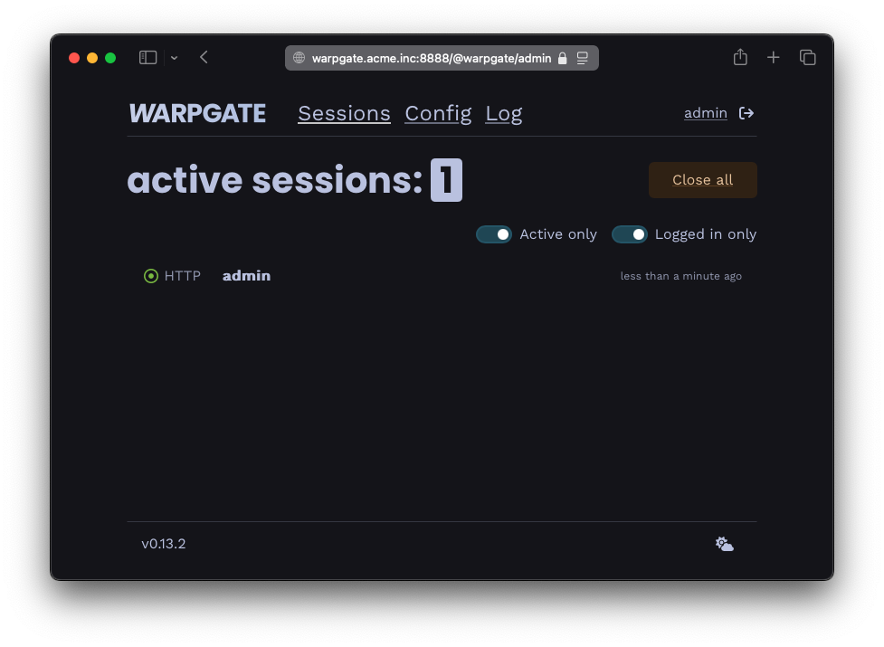

# Getting started (binary)

* Download the binary and save it as `/usr/bin/warpgate`:
    * a stable/beta release from the [Releases](https://github.com/Eugeny/warpgate/releases) page
    * or a nightly build from https://nightly.link/Eugeny/warpgate/workflows/build/main
* Make it executable:

```
chmod +x /usr/bin/warpgate
```

# Installation (Docker)

* See [Getting started on Docker](./getting-started-on-docker.md).

# Setup

Run `warpgate setup` and follow the prompts. If you want to use a non-default (`/etc/warpgate.yaml`) config path, pass it to all `warpgate` commands via `--config <path>`.

To use an external database (MySQL or PostgreSQL) instead of the built-in SQLite, add `--database-url mysql://...` or `--database-url postgres://...`.

!!! NOTE "Unattended setup"
    There's also a non-interactive setup mode available - check out `warpgate unattended-setup --help`

    <div class="badge font-xs text-bg-warning mt-3">v0.7+</div>

Here's what it might look like:

```
$ warpgate setup

13:43:10  INFO Welcome to Warpgate 0.6.0
13:43:10  INFO Let's do some basic setup first.
13:43:10  INFO The new config will be written in /etc/warpgate.yaml.
13:43:10  INFO * Paths can be either absolute or relative to /etc.
✔ Directory to store app data (up to a few MB) in · /var/lib/warpgate
✔ Endpoint to listen for SSH connections on · 0.0.0.0:2222
✔ Endpoint to expose admin web interface on · 0.0.0.0:8888
✔ Do you want to record user sessions? · yes
✔ Set a password for the Warpgate admin user · ********
13:43:28  INFO Generated configuration:
[...]
13:43:28  INFO Saved into /etc/warpgate.yaml
13:43:28  INFO Using config: "/etc/warpgate.yaml" (users: 1, targets: 1, roles: 1)
13:43:28  INFO Generating HTTPS certificate
13:43:28  INFO
13:43:28  INFO Admin user credentials:
13:43:28  INFO   * Username: admin
13:43:28  INFO   * Password: <your password>
13:43:28  INFO
13:43:28  INFO You can now start Warpgate with:
13:43:28  INFO   warpgate --config /etc/warpgate.yaml run
```

If you need to start over, delete or move away the config file and run `warpgate setup` again.

You can now start Warpgate with `warpgate run` and the output should look like this:

```
$ warpgate run

13:44:13  INFO Warpgate version=0.6.0
13:44:13  INFO Using config: "/etc/warpgate.yaml" (users: 1, targets: 1, roles: 1)
13:44:13  INFO --------------------------------------------
13:44:13  INFO Warpgate is now running.
13:44:13  INFO Accepting SSH connections on 0.0.0.0:2222
13:44:13  INFO Access admin UI on https://0.0.0.0:8888
13:44:13  INFO --------------------------------------------
13:44:13  INFO Listening address=0.0.0.0:2222
13:44:13  INFO Listening address=0.0.0.0:8888
```

Try accessing `https://<host>:8888/@warpgate/admin` (note the `https://`) via a browser to confirm that the Admin UI is functional.

The default username is `admin` and the password is the one you've set during setup.


/// caption
Login screen
///


/// caption
Session list in the admin UI
///


# Setting up as a service

On `systemd`, follow [[Installing as a systemd service]] to configure Warpgate to run as a service.

### Up next

* [Adding an SSH target](./targets/ssh.md)
* [Adding an HTTP target](./targets/http.md)
