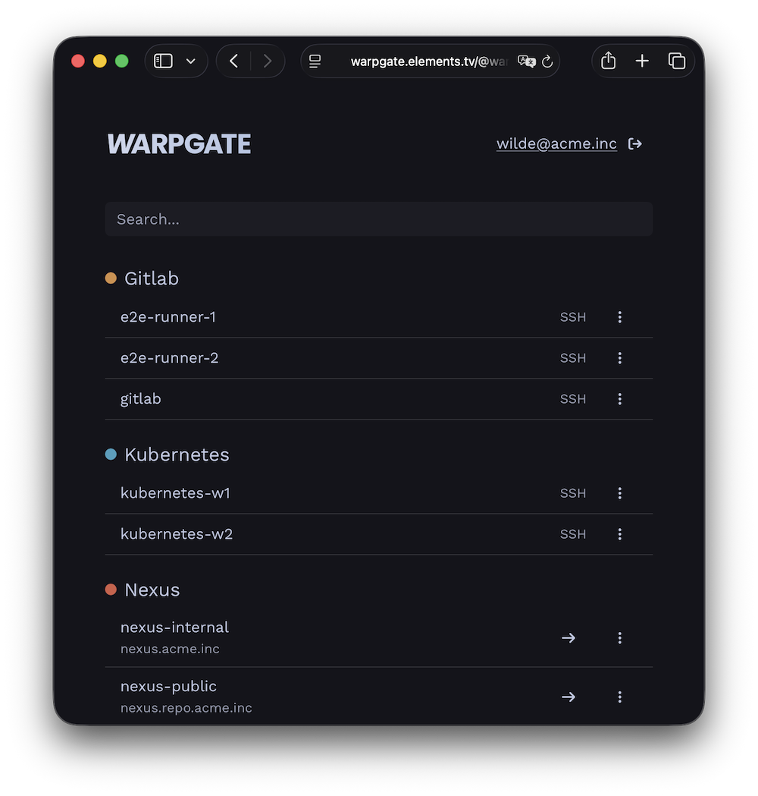
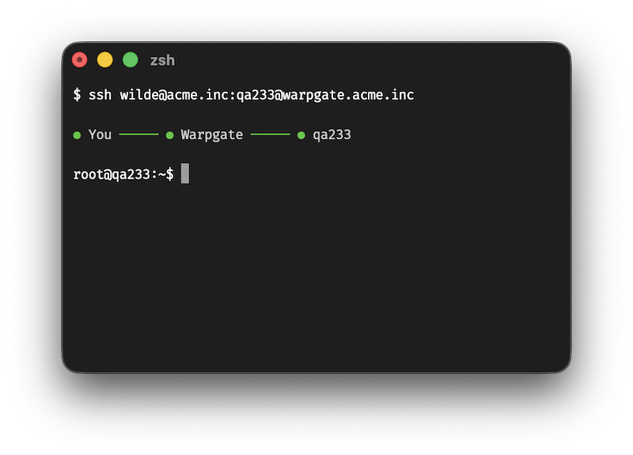
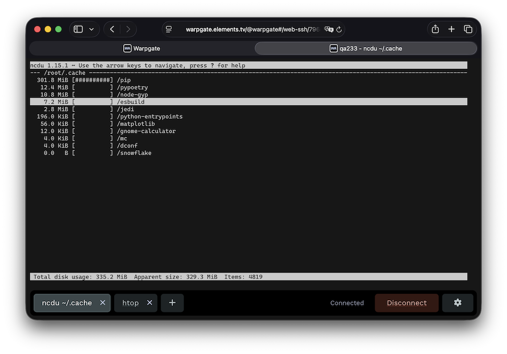
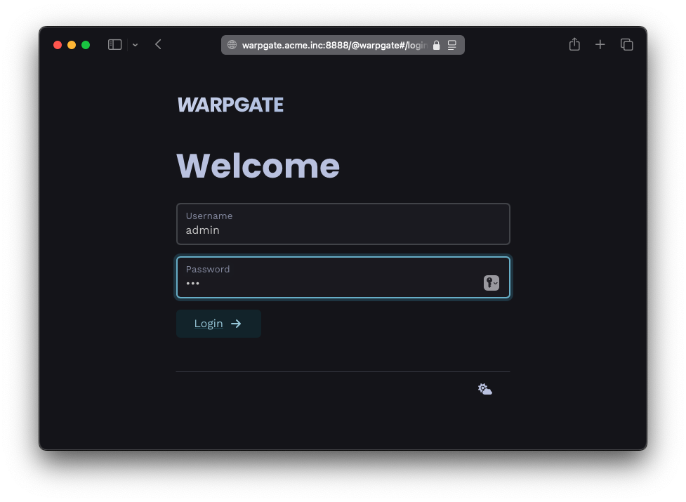
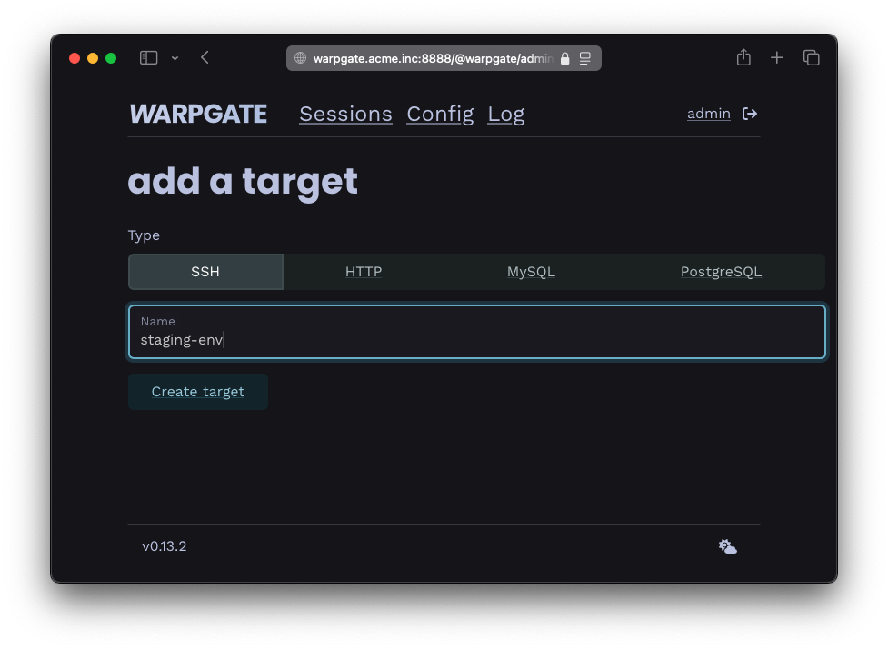
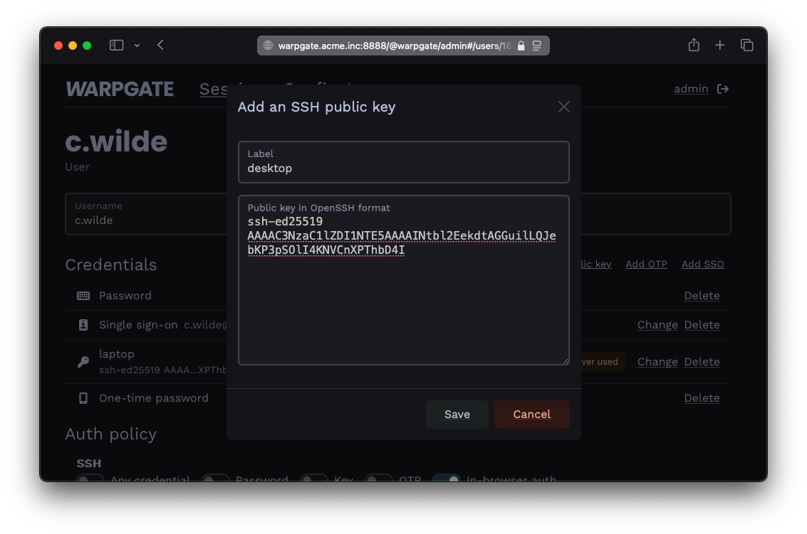
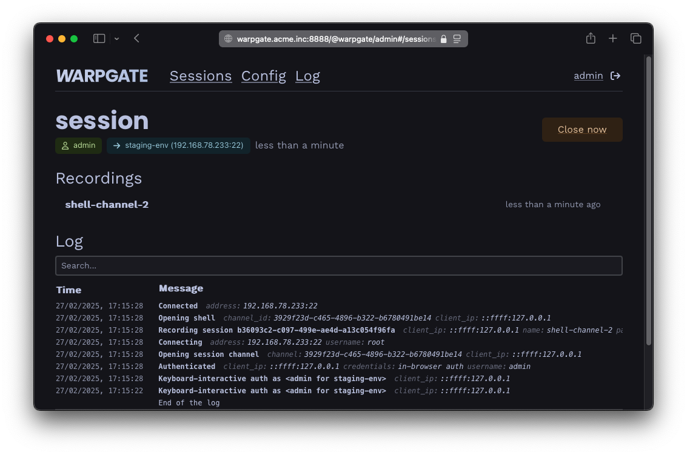
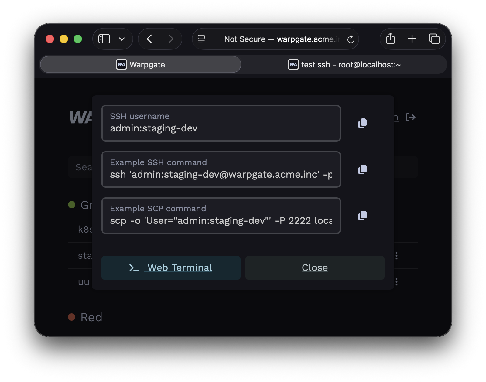

    

        

            <h1>The last bastion.</h1>
            
Secure access / PAM for your internal SSH, HTTPS, MySQL, Postgres and Kubernetes servers with SSO and RBAC.

            
No client apps.

            

                <a class="btn btn-success d-block" href="/getting-started-on-docker">Get started with Docker &rarr;</a>

                <a class="btn btn-secondary d-block" href="/getting-started">Get started (native) &rarr;</a>
            

        

        

            

        

    

    

        

            
        

        

            <h2>Elevator pitch</h2>
            

                Warpgate is a fully transparent proxy/bastion for your internal infrastructure that lets you skip manual <code>authorized_keys</code> management and both assign and audit access in a single place.
            

            

                It is an alternative to Teleport-style PAMs or a VPN, minus the client apps and connection rituals for your users must learn.
            

            

                Get it running in 15 minutes:
                <ul>
                <li>add your internal targets</li>
                <li>assign them to user groups</li>
                <li>tell your users where to log in.</li>
                </ul> Warpgate gives them a web page with copy-paste connection details and a browser-based terminal – and nothing to install.
            

        

    

    

        

            
        

        

            <h2>No client</h2>
            

                Warpgate directly exposes native protocol listeners.
                
Connect your VSCode through it.

                
Use it in your <code>DATABASE_URL</code>.

                
Connect to your Kubernetes clusters.

                
Or just open a terminal in your browser.

            

            <h2>Not a jump host</h2>
            
Warpgate handles authentication, and then transparently hands off the connection to the target server, while saving a live session record for audit.

            
Built-in 2FA, SSO and brute-force protection keep the front door locked.

        

    

    

        

            
        

        

            <h2>No SaaS bullshit</h2>
            

                Warpgate is a single binary (or a Docker image) that you download and run locally on your own infrastructure.
            

            <h2>No paid plan</h2>
            

                Warpgate is 100% open-source, free and will stay this way forever.
            

            

                It is financed through support contracts, and custom-order feature development.
            

            

                This allows it to escape the otherwise inevitable cycle of enshittification.
            

            <a class="btn btn-success" href="/for-business" target="_blank">Pro Support &rarr;</a>
        

    

## How is Warpgate different from a jump host / VPN / Teleport?

| Warpgate                                                 | SSH jump host                                                                                     | VPN                                                                | Teleport                                                                            |
| -------------------------------------------------------- | ------------------------------------------------------------------------------------------------- | ------------------------------------------------------------------ | ----------------------------------------------------------------------------------- |
| ✅ **Precise 1:1 assignment between users and services** | (Usually) full access to the network behind the jump host                                         | (Usually) full access to the network                               | ✅ **Precise 1:1 assignment between users and services**                            |
| ✅ **No custom client needed**                           | Jump host config needed                                                                           | ✅ **No custom client needed**                                     | Custom client required                                                              |
| ✅ **2FA out of the box**                                | 🟡 2FA possible with additional PAM plugins                                                       | 🟡 Depends on the provider                                         | ✅ **2FA out of the box**                                                           |
| ✅ **SSO out of the box**                                | 🟡 SSO possible with additional PAM plugins                                                       | 🟡 Depends on the provider                                         | Paid                                                                                |
| ✅ **Command-level audit**                               | 🟡 Connection-level audit on the jump host, no secure audit on the target if root access is given | No secure audit on the target if root access is given              | ✅ **Command-level audit**                                                          |
| ✅ **Full session recording**                            | No secure recording possible on the target if root access is given                                | No secure recording possible on the target if root access is given | ✅ **Full session recording**                                                       |
| ✅ **Non-interactive connections**                       | 🟡 Non-interactive connections are possible if the clients supports jump hosts natively           | ✅ **Non-interactive connections**                                 | Non-interactive connections require using an SSH client wrapper or running a tunnel |
| ✅ **Self-hosted, you own the data**                     | ✅ **Self-hosted, you own the data**                                                              | 🟡 Depends on the provider                                         | SaaS                                                                                |

    <h1> How does all this work?</h1>
    
You download and run a single binary or a Docker container:

    

    
You add your services:

    

    

        You add your users and decide who can access what:
        <small class="d-block text-muted">(OIDC SSO supported)</small>
    

    

    
Your users get a specially formatted username to connect to targets:

<pre class="text-start">
$ ssh c.wilde:staging-env@warpgate.acme.inc

 Warpgate  Selected target: staging-env
 Warpgate  Host key (ssh-ed25519): AAAAC3[...]

 ✓ Warpgate connected

 root@staging-env ~ $
</pre>

    
You get audit and observability:

    

    
And they get a web interface with instructions so you don't have to keep explaining it:

    

    
Sounds good?

    <a class="btn btn-warning" href="/docs">Read the docs</a>

