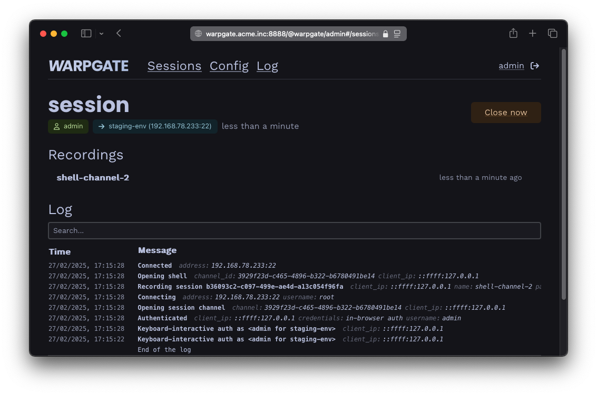

    

        <h1>The last bastion.</h1>
        
Secure access / PAM for your internal SSH, HTTPS, MySQL and Postgres servers with SSO and RBAC.

        
No client apps needed.

        

            <a class="btn btn-warning d-block" href="/docs">Read the docs</a>
            <a class="btn btn-success d-block" href="https://github.com/warp-tech/warpgate/releases" target="_blank">&darr; Download</a>
            <a class="btn btn-primary d-none d-sm-inline-block" href="https://github.com/warp-tech/warpgate" target="_blank">GitHub</a>
        

    

    

        

            <h1>No client</h1>
            
Warpgate directly exposes native SSH, HTTPS, MySQL and Postgres listeners.
            
Use it as a git proxy.

            
Connect your gRPC service through it.

            
Set it as your <code>DATABASE_URL</code>.

        

        

            <h1>No jump hosts</h1>
            
Warpgate handles authentication, and then transparently forwards the connection to the target server, while making a live recording for auditing.

        

    

    

        

            <h1>No paid plan</h1>
            

                Warpgate is 100% open-source, free and will stay this way forever.
            

            

                Warpgate is financed through support contracts, and custom-order feature development.
            

            

                This allows it to escape the otherwise inevitable cycle of stagnation or VC enshittification.
            

            <a class="btn btn-success" href="/support" target="_blank">Pro Support &rarr;</a>
        

        

            <h1>No SaaS bullshit</h1>
            

                Warpgate is a single binary (or a Docker image) that you download and run locally on your own hardware.
            

        

    

    <h1> How does all this work?</h1>
    
You download and run a single binary or a Docker container:

    

    
You add your services:

    

    

        You add your users and decide who can access what:
        <small class="d-block text-muted">(OIDC SSO supported)</small>
    

    

    
Your users get a specially formatted username to connect to targets:

<pre class="text-start">
$ ssh c.wilde:staging-env@warpgate.acme.inc

 Warpgate  Selected target: staging-env
 Warpgate  Host key (ssh-ed25519): AAAAC3[...]

 ✓ Warpgate connected

 root@staging-env ~ $
</pre>

    
You get audit and observability:

    

    
And they get a web interface with instructions so you don't have to keep explaining it:

    

    
Sounds good?

    <a class="btn btn-warning" href="/docs">Read the docs</a>

