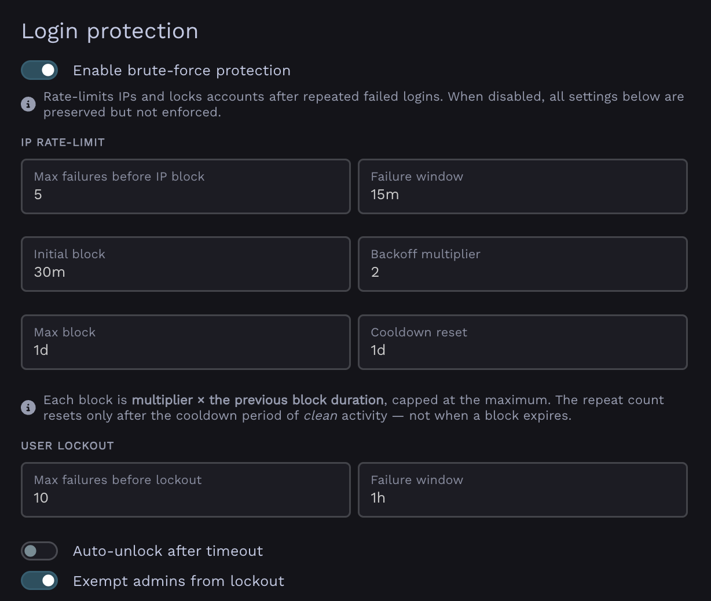

# Login protection

v0.26+

Warpgate has built-in, fail2ban-like protection against brute-force login attempts. It can automatically block offending IP addresses and lock out user accounts after repeated failures.

Failed login attempts are counted across all protocols.

You can configure login protection under `Config` > `Global parameters` > `Login protection`:

/// caption
Login protection configuration in Global Parameters
///

## IP blocking

When an IP address exceeds the allowed number of failed attempts within the time window, it is temporarily blocked from logging in. Each subsequent block for the same IP lasts longer (exponential backoff), up to a configurable maximum.

* **Max attempts** - failed attempts allowed before the IP is blocked.
* **Time window** - the period (in minutes) over which attempts are counted.
* **Base block duration** - duration of the first block.
* **Block duration multiplier** - each repeated block is multiplied by this factor (e.g. `2.0` → 30min, 1h, 2h, …).
* **Max block duration** - the cap on a single block's duration.
* **Cooldown reset** - how long an IP must stay clean before its backoff counter resets.

## User lockout

In addition to IP blocking, Warpgate can lock individual user accounts after repeated failed attempts against them.

* **Max attempts** - failed attempts allowed before the account is locked.
* **Time window** - the period (in minutes) over which attempts are counted.
* **Auto-unlock** - if enabled, locked accounts are released after the lockout duration; otherwise they stay locked until an admin unlocks them.
* **Lockout duration** - how long an account stays locked when auto-unlock is enabled.

## Managing blocks and lockouts

Admins can review currently blocked IPs and locked users, and clear them manually, from the Admin UI.

Blocked IPs and lockout records are retained for a configurable number of days (**Retention**) for auditing, after which they are pruned.
