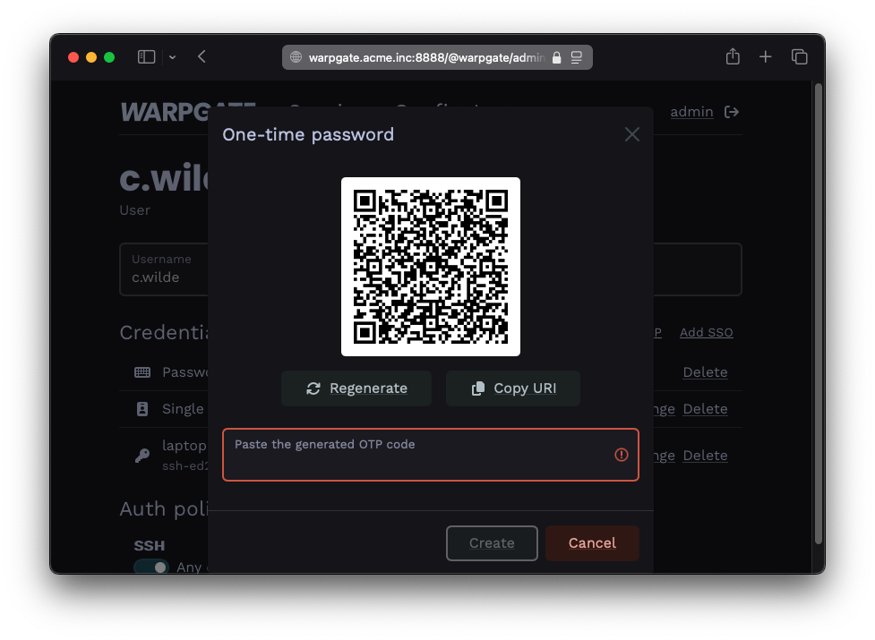
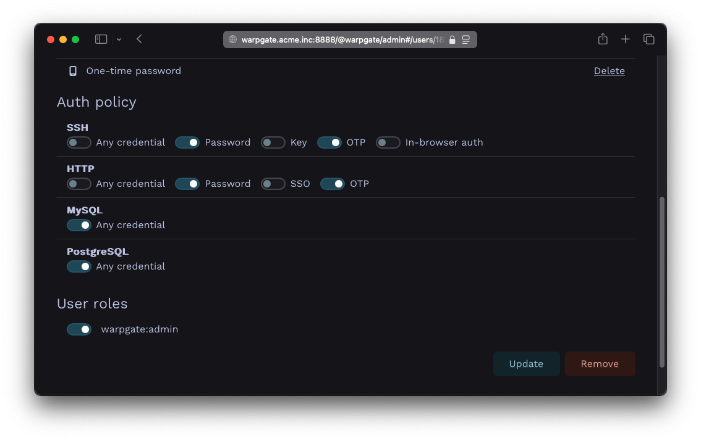

# One-time passwords (OTP)

## Configuration

Log into the Warpgate admin UI and navigate to `Config` > `Users` > `admin` and click `Add OTP`:

/// caption
Adding an OTP credential
///

The QR code shown can now be used to set up a mobile TOTP authenticator app.

Once done, click `Update configuration` to save.

## Credentials policy configuration for SSH & HTTP

To specify 2FA policies for SSH or HTTP sessions, uncheck `Any credential` in the corresponding `Auth policy section` and select all required credentials:

/// caption
Authentication policy with OTP
///
