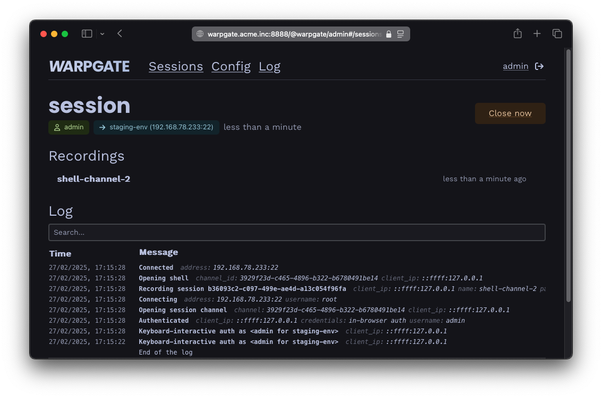
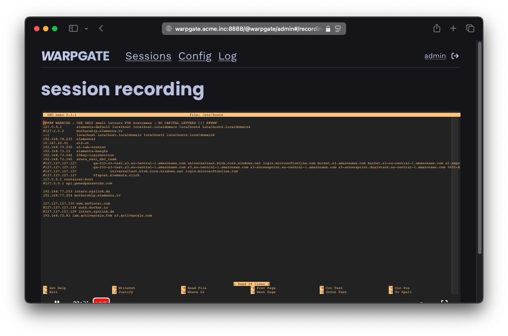

# Session recordings

Warpgate provides high-fidelity session recordings for all protocols it supports. This feature is particularly useful for auditing and troubleshooting user sessions.

## What is recorded?

Depending on the protocol, different aspects of the session are recorded:

### SSH Sessions

For SSH sessions, Warpgate records:
*   Standard output (STDOUT) and standard error (STDERR) as a terminal recording.
*   The raw terminal session data in ASCIINEMA format.
*   Metadata about the session (start/end time, source address, user, target).

### HTTP Sessions

For HTTP sessions, Warpgate logs:
*   Request and response headers.
*   The path, method, and query parameters.
*   Session duration and status codes.

### Database Sessions (MySQL & PostgreSQL)

For database connections:
*   The list of queries executed during the session (excluding sensitive data where possible).
*   Connection and disconnection events.

### Kubernetes Sessions

For Kubernetes API requests:
*   API request method, URL, and headers.
*   Request and response bodies (where applicable).
*   For interactive sessions like `kubectl exec`, a terminal recording is also available.

## Viewing Recording

To view a recording, navigate to the `Recordings` section in the Admin UI. You'll see a list of recent sessions and their recording status.


/// caption
Session log in the Admin UI
///

Click on a session entry for more details. If a terminal recording is available, you can play it directly in the browser:


/// caption
SSH session recording player
///

## Enabling/Disabling Recordings

Session recordings can be enabled or disabled globally in the configuration:

1.  Navigate to `Config` > `Global parameters`.
2.  Find the `Recordings` section.
3.  Toggle the `Enable recordings` switch.
4.  Optionally, specify a `Recordings path` to store recording files.

### Configuration Example

You can also configure recordings via the `config.yaml` file:

```yaml
recordings:
  enable: true
  path: "./data/recordings"
```

## Security & Privacy

Since session recordings can contain sensitive information, it's essential to follow these best practices:

*   **Restrict access to recordings**: Only authorized administrators with the appropriate roles should be able to view recordings.
*   **Rotation and Retention**: Set a retention policy for recordings to avoid consuming all your storage.
*   **Encrypted Storage**: Consider storing recordings on an encrypted volume for additional security.

### Retaining Recordings

By default, Warpgate keeps recordings indefinitely. You can configure a retention period to automatically delete old recordings:

```yaml
recordings:
  retention: 30days
```
