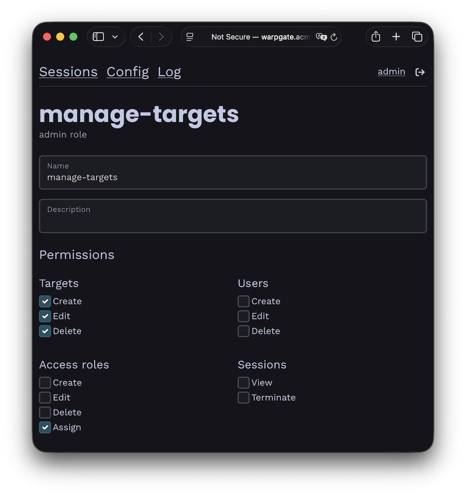

# User roles

Warpgate comes with two kinds of roles:

* **Access roles** are used to assign users to targets. A user that has a matching access role will be able to see and connect to the target.
* **Admin roles** grant partial or full access to the Warpgate admin UI. You can use admin roles to, for example, allow a user to manage targets but not users.

## Access roles

You can use _access roles_ to grant a new user access to multiple targets at once (or assign multiple users to a target).

* Create and remove roles under `Config` > `Access roles`.
* Assign roles to users and targets on their respective configuration pages.

## Admin roles

v0.23+

Admin roles grant granular permissions to the admin UI. Having _any_ single admin role assigned will allow a user to access the admin UI at `/@warpgate/admin`, and access to individual areas is controlled by the role's permissions.

* Create and remove roles under `Config` > `Admin roles`.
* Assign roles to users on their configuration page.

/// caption
Example admin role permisisons
///

*Note: before v0.23, admin access used to be granted via the `warpgate:admin` access role.*
