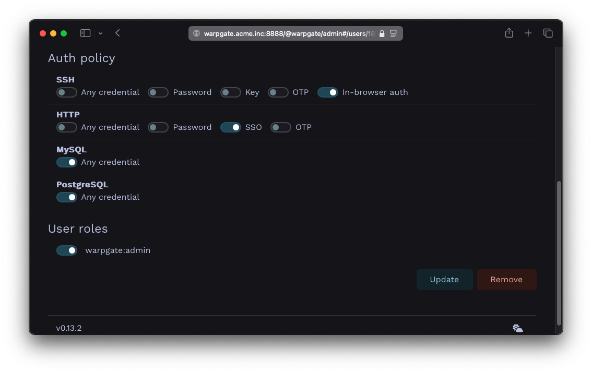
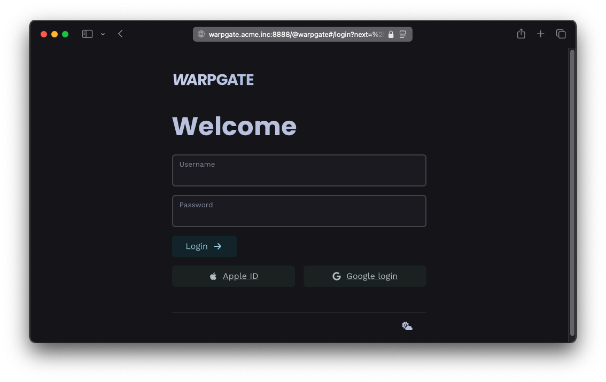
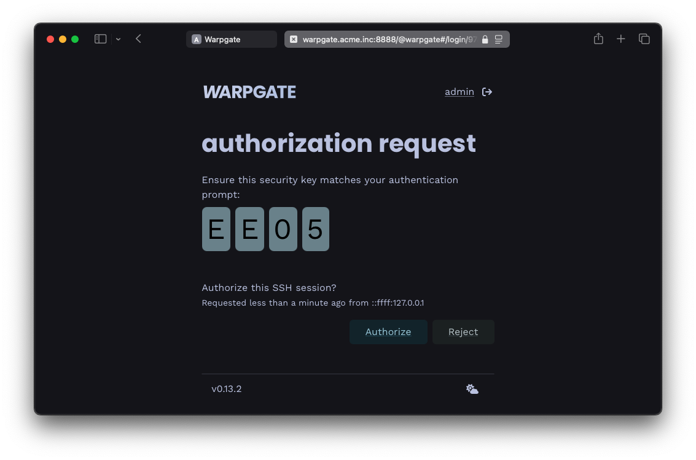

# Single sign-on

## Intro

Warpgate can use arbitrary OpenID Connect (OIDC) providers to authenticate users based on their verified emails.

OIDC providers include, but are not limited to:

* Google Accounts
* Sign in with Apple
* GitLab
* Microsoft Azure
* Okta

## Configuration

### Host header

<div class="badge font-xs text-bg-warning mb-3">v0.13+</div>

To use SSO, Warpgate needs to know what its external hostname is. Starting with v0.12, Warpgate uses the `Host` header to determine the external host. If you're [running behind a reverse proxy](reverse-proxy.md), the proxy needs to pass through the `Host` header.

### External host setting (legacy)

<div class="badge font-xs text-bg-danger mb-3">Pre v0.12</div>

Warpgate would try its best to figure it out based on the client's request, but it's better if you set it explicitly via the top-level `external_host` config option:

```diff
+ external_host: warpgate.acme.inc
```

> `external_host` can include a port as well

### Obtaining app credentials from a provider

You'll need to register your Warpgate instance as an "app" (terminology varies per provider) at the provider and obtain a _Client ID_ and a _Client secret_. You'll need to provide a _Redirect URL_ which - which will be verified by the SSO provider.

The _redirect URL_ (aka _return URL_) for Warpgate is `https://<warpgate-external-host>/@warpgate/api/sso/return`.

For providers that do not allow the @ sign in the URL (Azure), you can use an underscore instead: `https://<warpgate-external-host>/_warpgate/api/sso/return` (v0.17+ only):

```diff
  sso_providers:
  - name: azure
+   return_url_prefix: _
    provider:
      type: azure
      ...
```

Okta provides excellent guides on registering an app with various providers:

* [Google](https://developer.okta.com/docs/guides/social-login/google/main/#create-an-app-at-the-identity-provider)
* [Apple](https://developer.okta.com/docs/guides/social-login/apple/main/#create-an-app-at-the-identity-provider)
* [GitLab](https://developer.okta.com/docs/guides/social-login/gitlab/main/#create-an-app-at-the-identity-provider)
* [Microsoft Azure](https://docs.microsoft.com/en-us/azure/active-directory/develop/quickstart-register-app)

### Adding credentials to the config file

With a _Client ID_ and a _Client Secret_ in hand, you can add these to the Warpgate config file:

#### Google

```diff
external_host: warpgate.acme.inc:8888

+ sso_providers:
+ - name: google
+   label: Google login
+   provider:
+     type: google
+     client_id: 1234...
+     client_secret: ABC...
```

#### Microsoft Azure

```diff
external_host: warpgate.acme.inc:8888

+ sso_providers:
+ - name: azure
+   return_url_prefix: _
+   provider:
+     type: azure
+     client_id: 123...
+     client_secret: ABC...
+     tenant: XYZ...
```


#### Apple

```diff
external_host: warpgate.acme.inc:8888

+ sso_providers:
+ - name: apple
+   label: Apple ID
+   provider:
+     type: apple
+     team_id: ABC...  # your Apple Team ID
+     client_id: com.warpgate.test  # your Service ID (not the App ID!)
+     key_id: ABC...  # the ID of the key you've created
+     client_secret: ABC...  # Base64 encoded contents of the .p8 private key file you've got from Apple

```

#### Custom


```diff
external_host: warpgate.acme.inc:8888

+ sso_providers:
+ - name: custom
+   label: ACME SSO
+   provider:
+     type: custom
+     client_id: 123...
+     client_secret: ABC...
+     issuer_url: https://sso.acme.inc
+     scopes: ["email"]
```

### OIDC audience verification

Normally, the OIDC provider should issue a token that is only valid for Warpgate itself. If this is not possible, you have two options:

* Explicitly whitelist additional trusted audiences:

```diff
  sso_providers:
  - name: custom
    label: ACME SSO
+   additional_trusted_audiences:
+   - one
+   - two
    provider:
    ...
```

* Fully ignore any additional audiences in the token (v0.13.1+):

```diff
  sso_providers:
  - name: custom
    label: ACME SSO
+   trust_unknown_audiences: true
    provider:
    ...
```

### Automatically creating users

<div class="badge font-xs text-bg-warning mb-3">v0.13+</div>

Warpgate can automatically create users for new SSO logins. The SSO server has to provide the `preferred_username` OIDC claim for this to work.

```diff
  sso_providers:
  - name: custom
    label: ACME SSO
+   auto_create_users: true
    provider:
    ...
```

### Requiring SSO for a user

Users are linked to their SSO accounts based on their email. If the SSO provider advertises email verification status, Warpgate will require the email to be verified.

To link a user to SSO, click `Add SSO` in the credentials section, and then (optionally) set SSO as the only accepted credential type for HTTP connections.


/// caption
Setting SSO as the only authentication method
///

Here, we've also set SSO to be the only allowed login credential for HTTP auth, and have set SSH to use out-of-band web authentication.

> `In-browser auth` (OOB web authentication) means that Warpgate will send a login link to the SSH client and will wait for the user to authenticate themselves in a browser. The auth requirements will be the same as set for the `http` protocol.

```
❯ ssh cwilde:tnt@warpgate.acme.inc -p 2222
----------------------------------------------------------------
Warpgate authentication: please open https://warpgate.acme.inc/@warpgate#/login/31282192-ad29-4fa7-bdc2-5b481d531e58 in your browser

Make sure you're seeing this security key: E E 0 5
----------------------------------------------------------------

(cwilde:tnt@warpgate.acme.inc) Press Enter when done:
```


/// caption
Login page with SSO buttons
///



/// caption
In-browser auth request
///

### Setting roles via SSO

With `custom` type OIDC providers, Warpgate can also sync the user's role memberships when they log in.

For that, your provider must set a `warpgate_roles` OIDC claim (a JSON array of role names) either in the ID Token or the UserInfo response. By default, Warpgate will use these names as-is and completely overwrite the user's memberships.

You can also set `role_mappings` in the provider's configuration to explicitly map claim values to role names. In this case, only the roles mentioned here will be synced SSO, and the memberships in other roles won't be affected. For example:

```yaml
- name: oidc-custom
  label: Custom SSO
  provider:
    type: custom
    client_id: ...
    client_secret: ...
    issuer_url: ...
    scopes: []
    role_mappings:
      'QA group': 'qa'
      Admins: 'warpgate:admin'
```

#### Syncing Google Workspace groups

<div class="badge font-xs text-bg-warning mb-3">v0.22+</div>

Google Workspace does not expose group memberships in OIDC claims, but Warpgate can use Google's Directory API to fetch the user's groups during login.

For that you'll need to:

* Create a new Google Cloud [service account](https://console.cloud.google.com/iam-admin/serviceaccounts). Note the _Service Account E-mail_ and _Client ID_.

* Create a new JSON _private key_ for the account and download it.

* Open the key file and copy the `private_key` JSON value from it as-is.

* Add the new SSO provider properties:

```diff
  - name: google
    label: Google
    provider:
      type: google
      client_id: 123....
      client_secret: GOCSPX...
+     admin_email: admin@acme.inc
+     role_mappings:
+       qa@acme.inc: qa
+     admin_role_mappings:
+       admins@acme.inc: 'warpgate:admin'
+     service_account_email: warpgate@xyz.iam.gserviceaccount.com
+     service_account_key: "-----BEGIN PRIVATE...
```

  * `admin_email` is the email of a Google Workspace admin user that Warpgate will impersonate when calling the Directory API.

* Enable [Admin SDK API](https://console.cloud.google.com/apis/api/admin.googleapis.com).

* Enable [domain-wide delegation](https://admin.google.com/u/4/ac/owl/domainwidedelegation), using your service account's *Client ID* (visible in the [service accounts list](https://console.cloud.google.com/iam-admin/serviceaccounts)) and `https://www.googleapis.com/auth/admin.directory.group.readonly` scope value.
