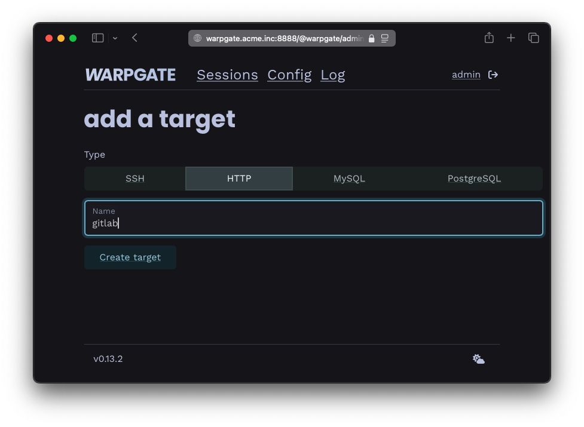
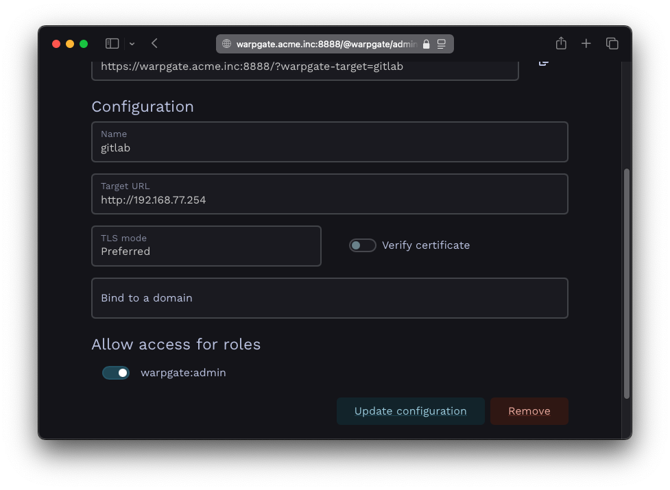
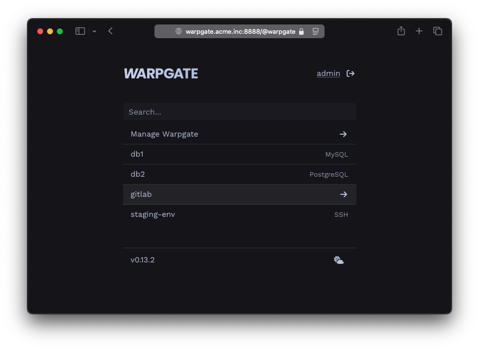
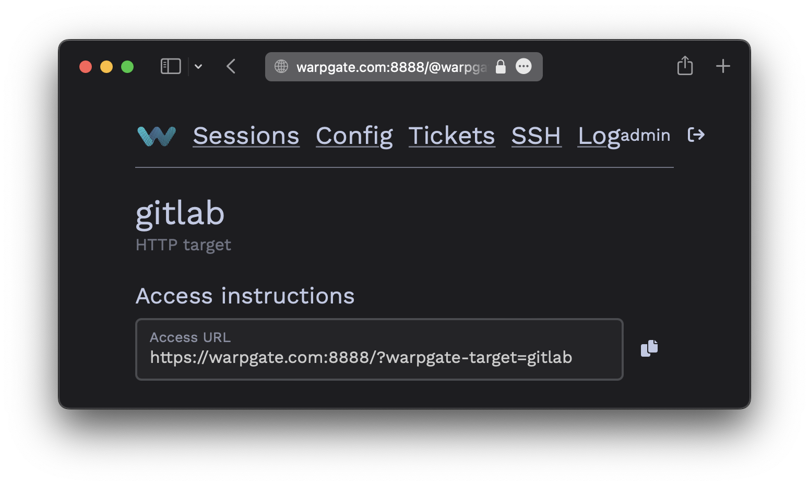
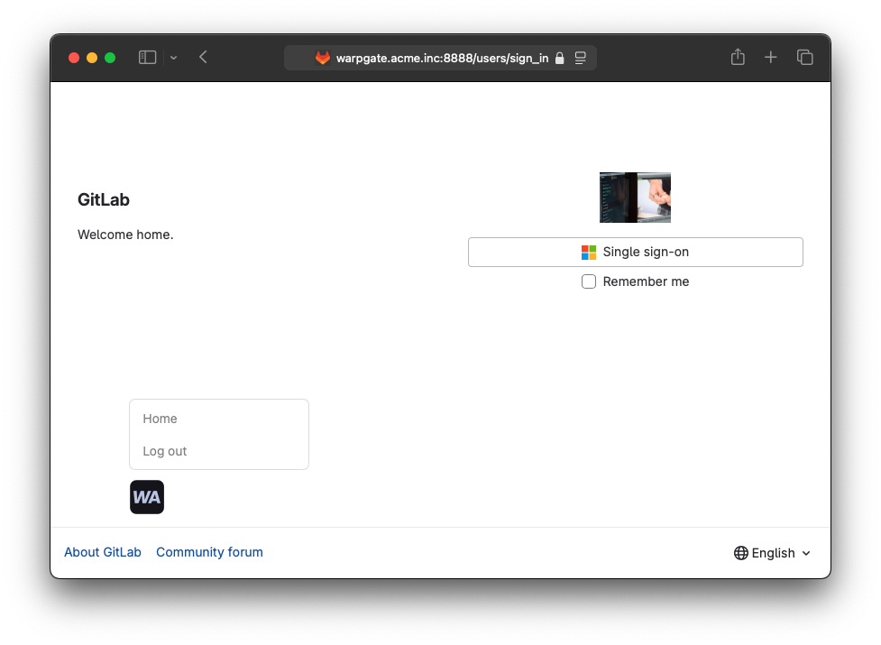

# Adding HTTP targets

## Connection setup

Log into the Warpgate admin UI and navigate to `Config` > `Targets` > `Add target` and give the new HTTP target a name:


/// caption
Adding an HTTP target
///

Fill out the configuration:

* **Target URL**: the destination web service, including the protocol (`http://` or `https://`).
* **TLS mode**: whether to ignore, prefer or require TLS (overrides the URL's protocol).
* **Verify certificate**: whether to reject untrusted certificates.
* **Bind to a domain**: link this target to a specific sub-domain of the domain Warpgate is on - see [HTTP domain binding](../http-domain-binding.md)

Example:


/// caption
HTTP target configuration
///

The target should show up on the Warpgate's homepage:


/// caption
HTTP target on the home page
///

# Accessing the target

Users can either access the target by selecting it on the Warpgate's homepage, with a direct URL:

```
https://<warpgate host>:<port>/?warpgate-target=<name>
```

You can also find a copyable URL in the _Targets_ section of the admin UI:


/// caption
HTTP connection instructions
///

While the target is active, Warpgate will pass-through all HTTP traffic in this session straight to it. You can return back to the homepage by manually navigating to `/@warpgate`, or by using the injected session menu (shown below). The menu button can be dragged around to stay out of the way and will remember its location.


/// caption
Accessing an HTTP target
///

### Up next

* [User authentication and roles](../auth-and-roles.md)
