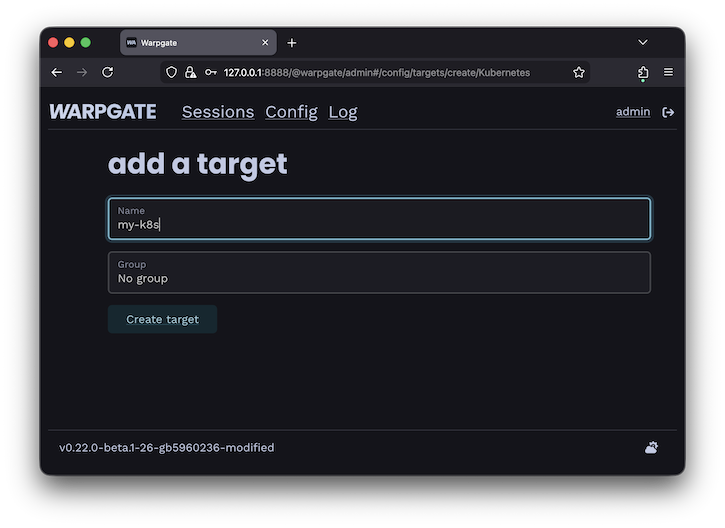
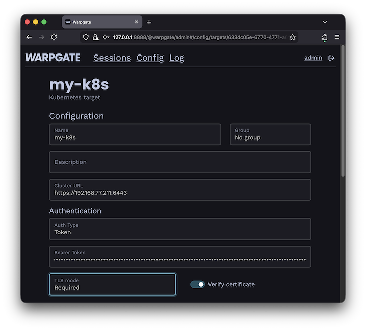
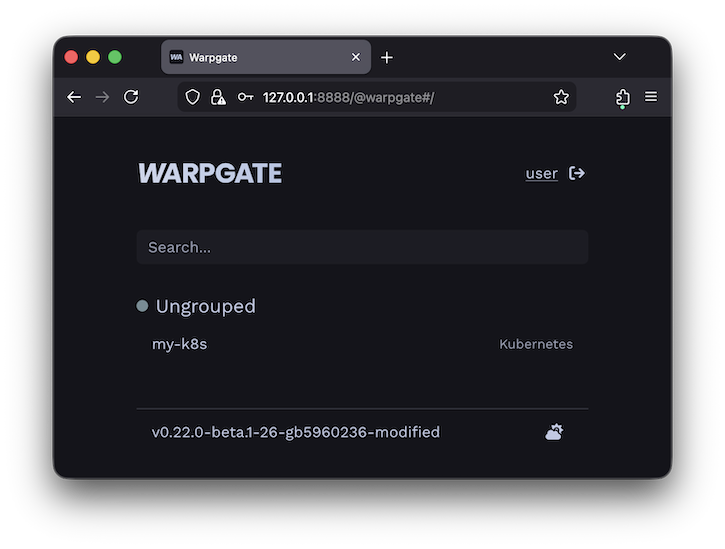
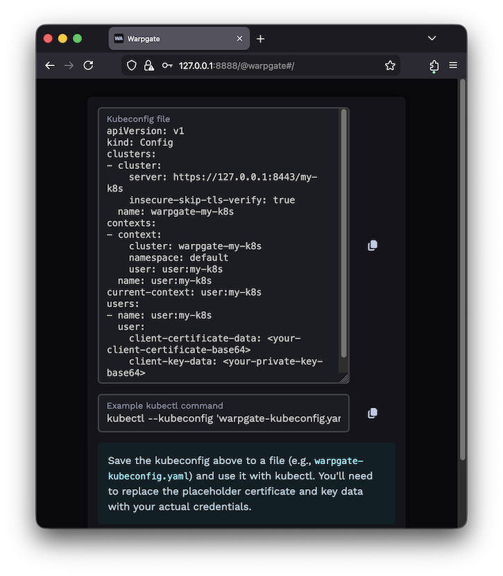
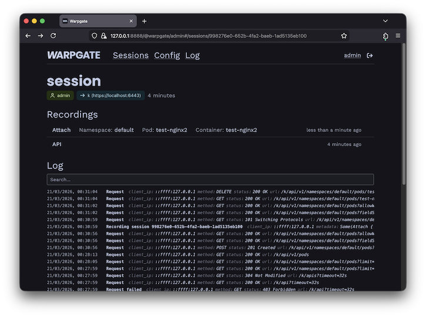

# Adding a Kubernetes target

<div class="badge font-xs text-bg-warning mb-3">v0.21+</div>

Warpgate allows you to securely access Kubernetes clusters through a unified entry point, providing auditing and session recording for all API requests.

## How it works

When you add a Kubernetes target, Warpgate acts as an authenticating proxy for the Kubernetes API. Users connect to Warpgate using their own credentials (either an API token or a client certificate), and Warpgate then connects to the upstream Kubernetes cluster using the authentication details you've configured.

All requests are recorded and can be audited later.

## Enabling Kubernetes listener

Enable the Kubernetes protocol in your config file (default: `/etc/warpgate.yaml`) if you didn't do so during the initial setup:

```diff
+ kubernetes:
+   enable: true
+   listen: '[::]:8443'
+   certificate: /var/lib/warpgate/tls.certificate.pem
+   key: /var/lib/warpgate/tls.key.pem
```

You can reuse the same certificate and key that are used for the HTTP listener.

## Connection setup

Log into the Warpgate admin UI and navigate to `Config` > `Targets` > `Add target` and give the new Kubernetes target a name:


/// caption
Adding a Kubernetes target
///

Fill out the configuration:


/// caption
Kubernetes target configuration
///

The target should show up on the Warpgate's homepage:


/// caption
Kubernetes target on the homepage
///

Users will be able to click the entry to obtain connection instructions:


/// caption
Kubernetes target on the homepage
///

## Client setup

You can now use `kubectl` or any other Kubernetes client applications to connect through Warpgate with the settings shown. You can also use a Warpgate API token as a Bearer token when connecting to the Kubernetes API endpoint.

While your Kubernetes client is active, you'll be able to see the session status in the Admin UI, including the log, API queries and session recordings:


/// caption
Kubernetes session view
///
