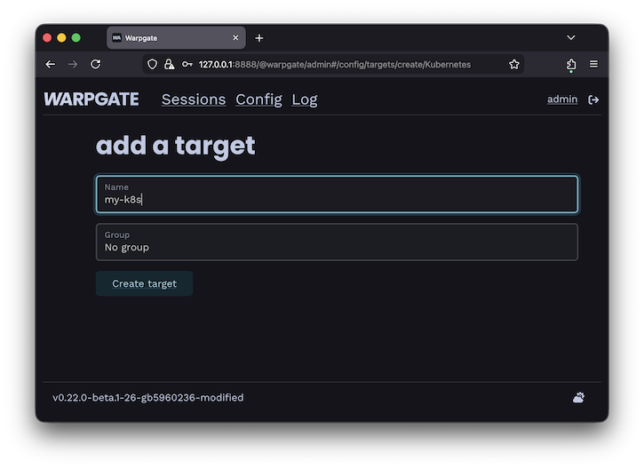
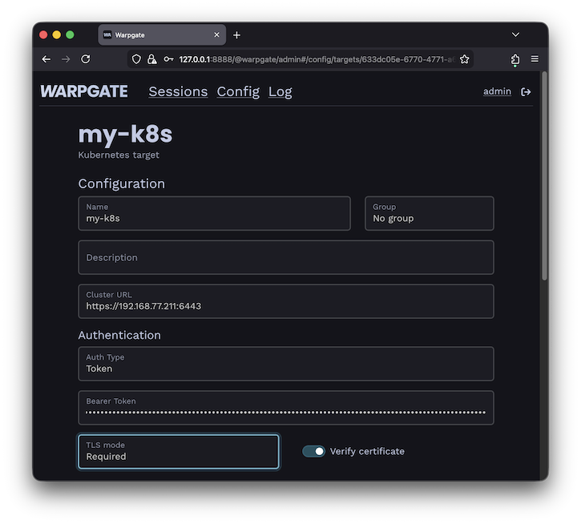
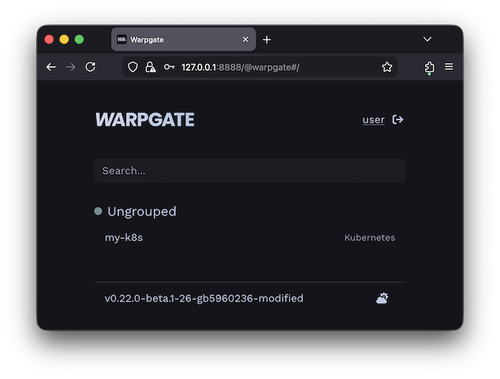
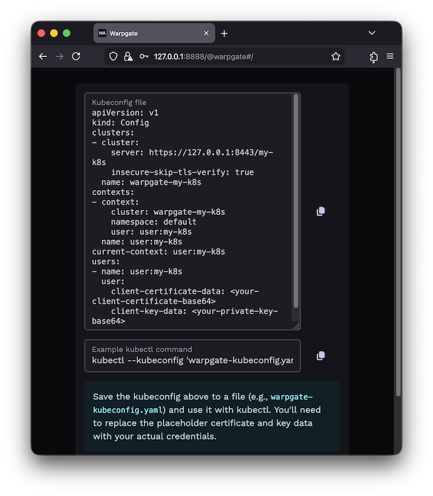
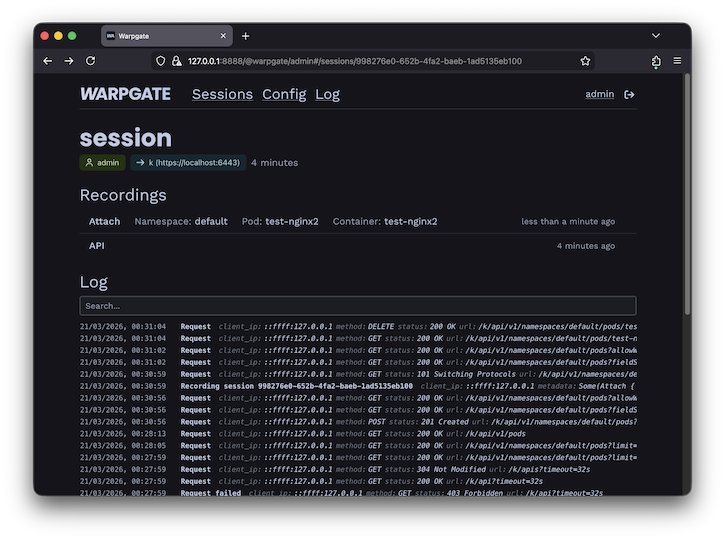

# Adding a Kubernetes target

<div class="badge font-xs text-bg-warning mb-3">v0.21+</div>

Warpgate allows you to securely access Kubernetes clusters through a unified entry point, providing auditing and session recording for all API requests.

## How it works

When you add a Kubernetes target, Warpgate acts as an authenticating proxy for the Kubernetes API. Users connect to Warpgate with their own credentials — a client certificate, a Warpgate API token, or [single sign-on via kubelogin](#single-sign-on-with-kubelogin) — and Warpgate connects to the upstream cluster using the authentication you've configured (a client certificate, a bearer token, or an [EKS IAM role](#aws-eks-iam-authentication)).

All requests are recorded and can be audited later.

## Enabling Kubernetes listener

Enable the Kubernetes protocol in your config file (default: `/etc/warpgate.yaml`) if you didn't do so during the initial setup:

```diff
+ kubernetes:
+   enable: true
+   listen: '[::]:8443'
+   certificate: /var/lib/warpgate/tls.certificate.pem
+   key: /var/lib/warpgate/tls.key.pem
```

You can reuse the same certificate and key that are used for the HTTP listener.

## Connection setup

Log into the Warpgate admin UI and navigate to `Config` > `Targets` > `Add target` and give the new Kubernetes target a name:


/// caption
Adding a Kubernetes target
///

Fill out the configuration:


/// caption
Kubernetes target configuration
///

The target should show up on the Warpgate's homepage:


/// caption
Kubernetes target on the homepage
///

Users will be able to click the entry to obtain connection instructions:


/// caption
Kubernetes target on the homepage
///

Note that this dialog offers an option to issue a new certificate in-place, storing it in the browser. This allows the frontend to generate a drop-in `kubeconfig` file with credentials already pre-filled.

See [Authentication](../auth.md/#adding-a-client-certificate-for-a-user) for details on certificate key storage.

## Client setup

You can now use `kubectl` or any other Kubernetes client applications to connect through Warpgate with the settings shown. You can also use a Warpgate API token as a Bearer token when connecting to the Kubernetes API endpoint.

While your Kubernetes client is active, you'll be able to see the session status in the Admin UI, including the log, API queries and session recordings:


/// caption
Kubernetes session view
///

Warpgate records API calls and can replay `exec`, `run` and `attach` sessions.

## AWS EKS IAM authentication

<div class="badge font-xs text-bg-warning mb-3">v0.22+</div>

If Warpgate runs on AWS, it can authenticate to an EKS cluster using its IAM role instead of a stored certificate or token. Select **IAM Role** as the target's authentication method (shown only when Warpgate detects it is running on EC2). Warpgate resolves the EKS cluster from the cluster URL and generates a short-lived EKS token.

Map Warpgate's IAM role to a Kubernetes user or group in the cluster's access configuration (`aws-auth` ConfigMap or access entries).

## Single sign-on with kubelogin

<div class="badge font-xs text-bg-warning mb-3">v0.27+</div>

Instead of a Warpgate-issued client certificate, users can authenticate to Kubernetes targets over SSO, using the [kubelogin](https://github.com/int128/kubelogin) (`oidc-login`) `kubectl` plugin to obtain an OIDC token directly from the OIDC provider.

To enable it, add a `kubernetes` block to a `custom` (issuer-based) SSO provider in your config file:

```diff
  sso_providers:
    - name: my-idp
      label: Company SSO
      provider:
        type: custom
        client_id: ...
        client_secret: ...
        issuer_url: https://sso.acme.inc
        scopes: ["email"]
+       additional_trusted_audiences: ["kubernetes"]
+   kubernetes:
+     client_id: kubernetes                     # the OIDC client id kubectl will use
+     # scopes: ["openid", "email", "profile"]  # optional
+     # client_secret: ...                      # optional, for confidential clients
```

* Only `custom` (issuer-based) providers can be used for Kubernetes SSO.
* The `client_id` you set under `kubernetes` must also appear in the provider's `additional_trusted_audiences`, so that tokens `kubectl` obtains are accepted.
* Users need the `kubelogin` (`oidc-login`) `kubectl` plugin installed.

Once configured, the target's **Access instructions** dialog offers an "OIDC with kubelogin" option that generates a ready-to-use `kubeconfig`, alongside the certificate option.
