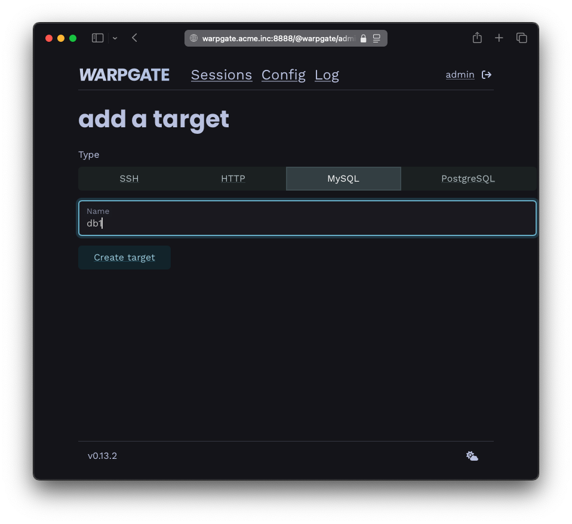
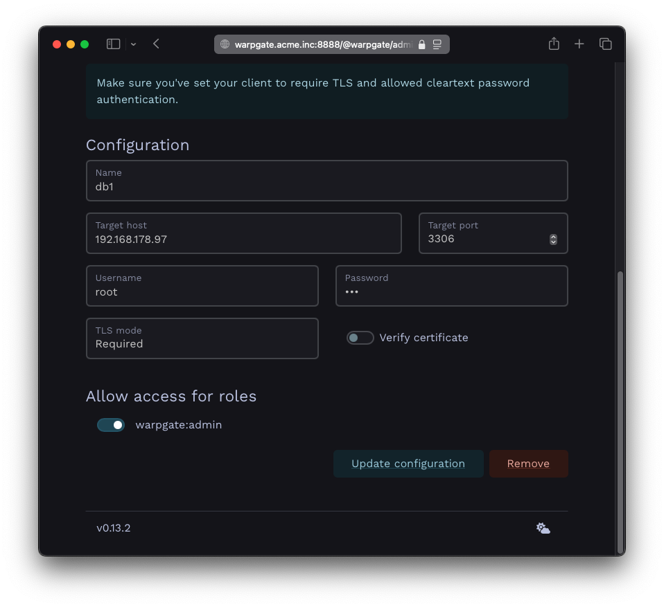
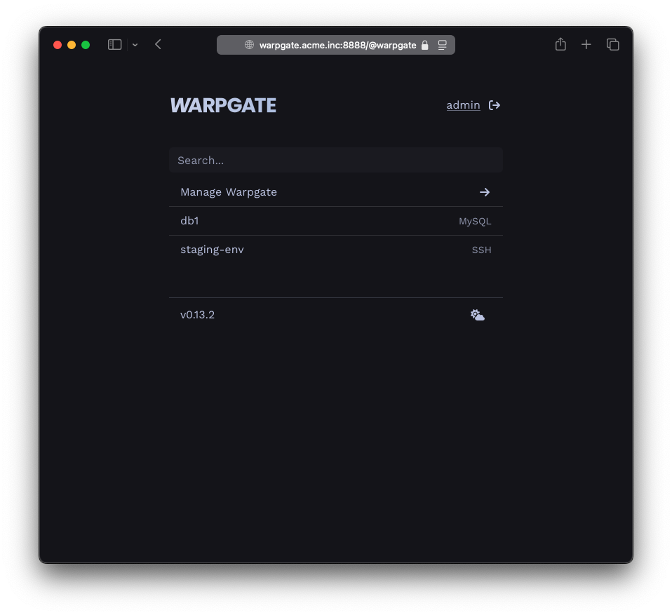
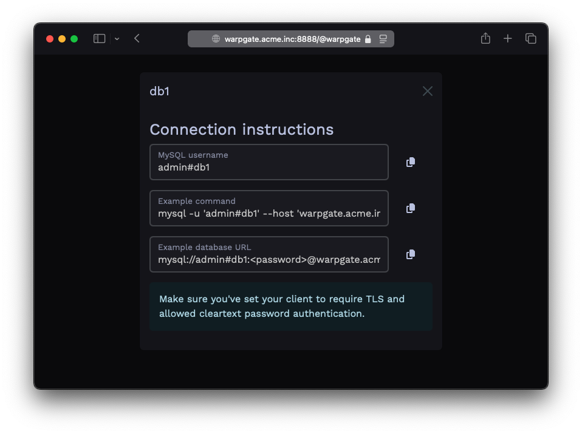
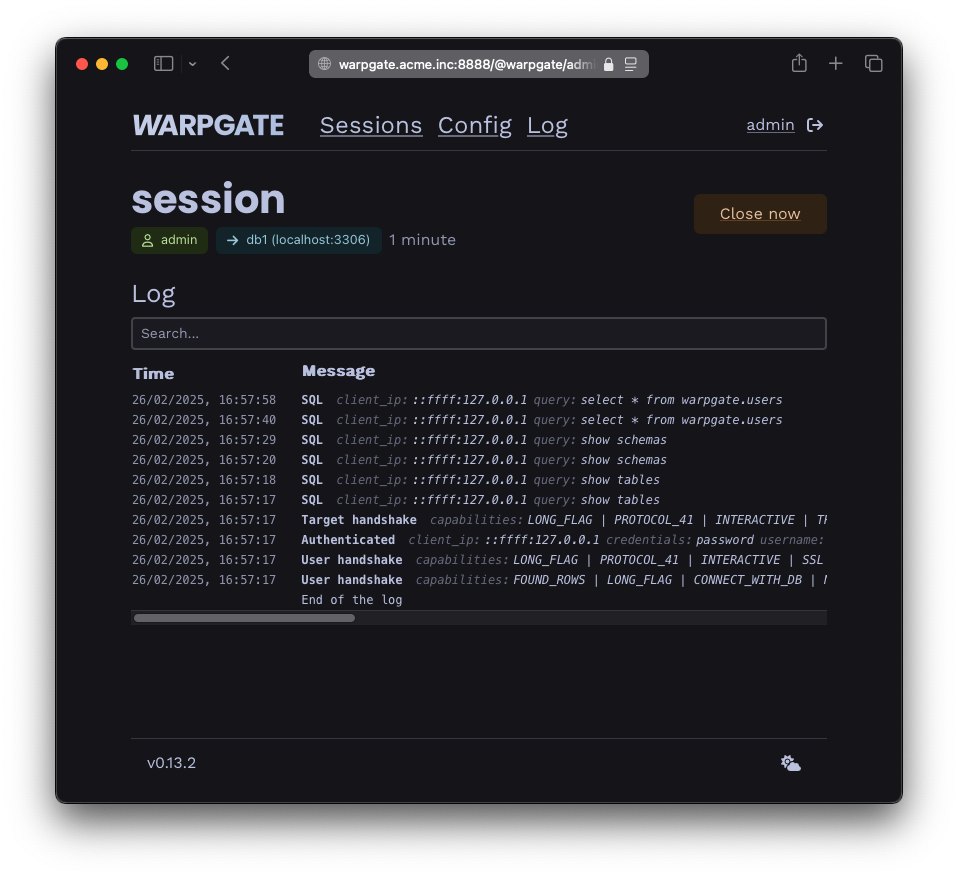

# Adding MySQL targets

## Authentication setup

Warpgate connects to MySQL and MariaDB servers with a username and password, negotiating whichever authentication plugin the server offers: `mysql_native_password`, `sha256_password` or `caching_sha2_password` (v0.27+).

As a MySQL protocol server (towards clients), Warpgate only allows secure (TLS) connections and uses the `mysql_clear_password` auth mode.

## Enabling MySQL listener

Enable the MySQL protocol in your config file (default: `/etc/warpgate.yaml`) if you didn't do so during the initial setup:

```diff
+ mysql:
+   enable: true
+   certificate: /var/lib/warpgate/tls.certificate.pem
+   key: /var/lib/warpgate/tls.key.pem
```

You can reuse the same certificate and key that are used for the HTTP listener.

## Connection setup

Log into the Warpgate admin UI and navigate to `Config` > `Targets` > `Add target` and give the new MySQL target a name:


/// caption
Adding a MySQL target
///

Fill out the configuration:


/// caption
MySQL target configuration
///

The target should show up on the Warpgate's homepage:


/// caption
MySQL target on the homepage
///

Users will be able to click the entry to obtain connection instructions:


/// caption
MySQL target on the homepage
///

## Client setup

You can now use any MySQL/MariaDB client applications to connect through Warpgate with the following settings:

* Host: the Warpgate host
* Port: the Warpgate MySQL port (default: 33306)
* Username: `admin#<target-name>` or `admin:<target-name>`, in this example: `admin#db1`
* Password: your Warpgate admin password
* TLS : enabled
* Cleartext password authentication: allowed

If your client uses a database URL, use: `mysql://<username>#<target>:<password>@<warpgate host>:<warpgate mysql port>?sslMode=required`

While your MySQL session is running, you'll be able to see its status in the Admin UI, including the query log:


/// caption
MySQL session log
///


### AWS RDS IAM authentication

<div class="badge font-xs text-bg-warning mb-3">v0.22+</div>

If Warpgate runs on AWS, it can connect to an RDS instance using a short-lived IAM authentication token instead of a stored password. Select **IAM Role** as the target's authentication method (shown only when Warpgate detects it is running on EC2) and set the target username to the RDS database user.

* The RDS instance must have IAM database authentication enabled.
* Warpgate's IAM role needs the `rds-db:connect` action for that database user.
* The AWS region is derived from the RDS endpoint hostname.

### Up next

* [User authentication](../auth.md)
