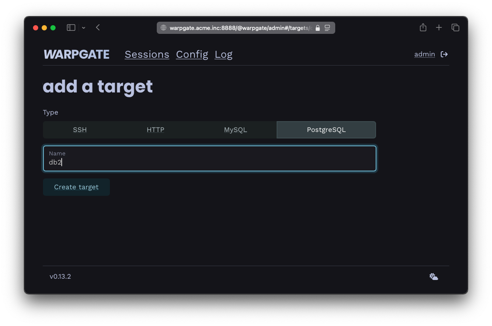
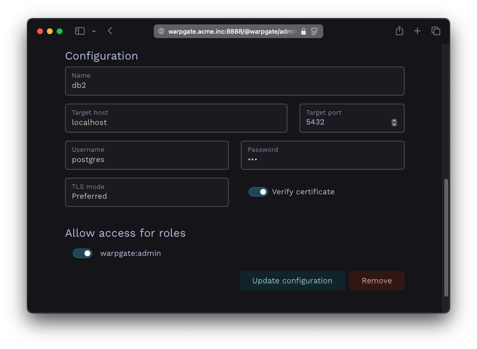
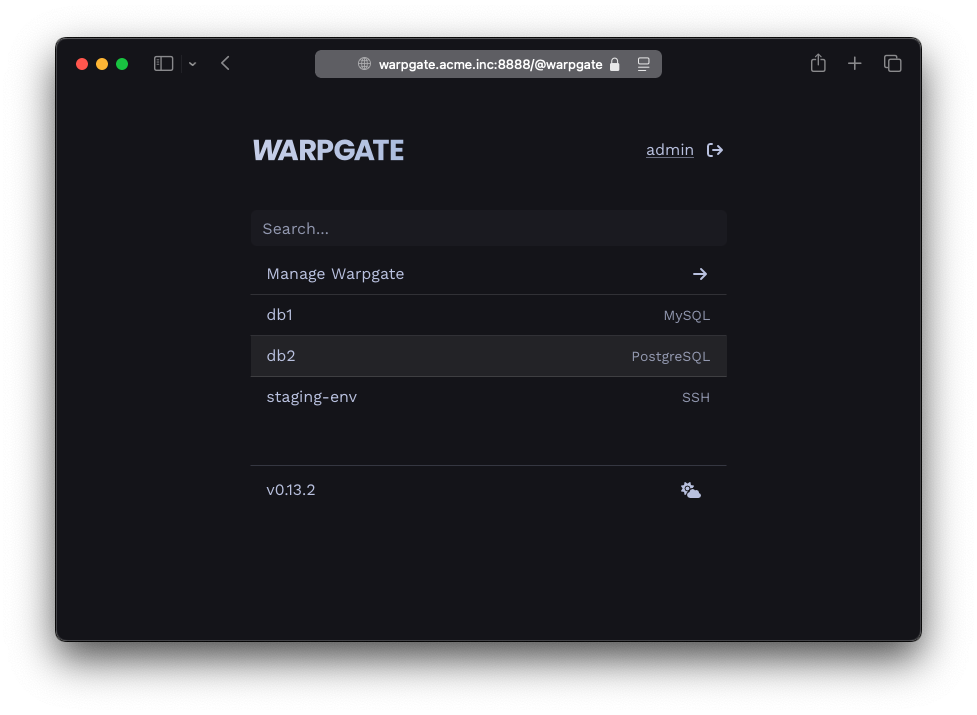
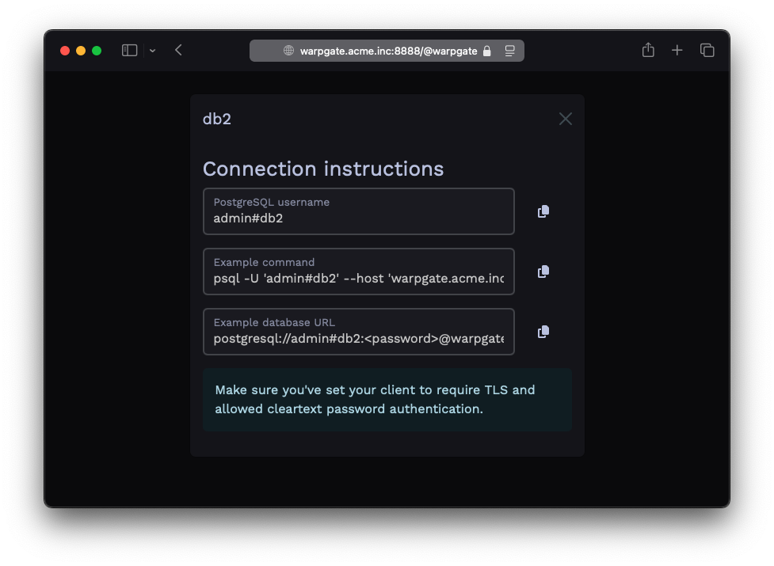
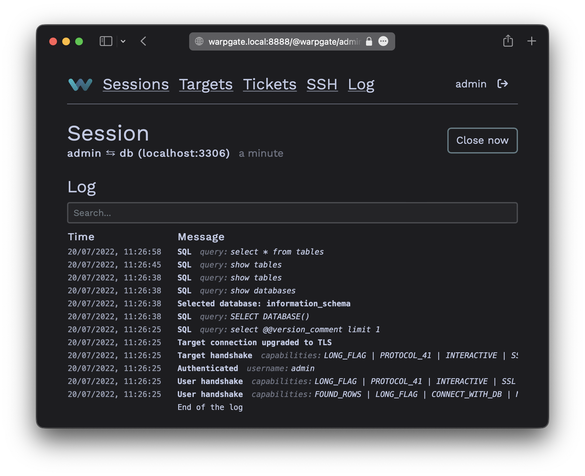

# Adding PostgreSQL targets

## Authentication setup

Currently, Warpgate can connect to PostgreSQL servers with a username/password using `md5` and `password` (plaintext) auth mode.

As a PostgreSQL protocol server, Warpgate only allows secure (TLS) connections and uses `password` auth mode.

## Enabling PostgreSQL listener

Enable the PostgreSQL protocol in your config file (default: `/etc/warpgate.yaml`) if you didn't do so during the initial setup:

```diff
+ postgres:
+   enable: true
+   certificate: /var/lib/warpgate/tls.certificate.pem
+   key: /var/lib/warpgate/tls.key.pem
```

You can reuse the same certificate and key that are used for the HTTP listener.

## Connection setup

Log into the Warpgate admin UI and navigate to `Config` > `Targets` > `Add target` and give the new PostgreSQL target a name:


/// caption
Adding a PostgreSQL target
///

Fill out the configuration:


/// caption
PostgreSQL target configuration
///

The target should show up on the Warpgate's homepage:


/// caption
PostgreSQL target on the homepage
///

Users will be able to click the entry to obtain connection instructions:


/// caption
PostgreSQL target connection instructions
///

## Client setup

You can now use any PostgreSQL client applications to connect through Warpgate with the following settings:

* Host: the Warpgate host
* Port: the Warpgate PostgreSQL port (default: 55432)
* Username: `admin#<target-name>` or `admin:<target-name>`, in this example: `admin#db1`
* Password: your Warpgate admin password
* TLS: enabled
* Cleartext password authentication: allowed

If your client uses a database URL, use: `postgresql://<username>#<target>:<password>@<warpgate host>:<warpgate postgresql port>?sslmode=require`

While your PostgreSQL session is running, you'll be able to see its status in the Admin UI, including the query log:


/// caption
PostgreSQL session log
///

### Up next

* [User authentication and roles](../auth-and-roles.md)
