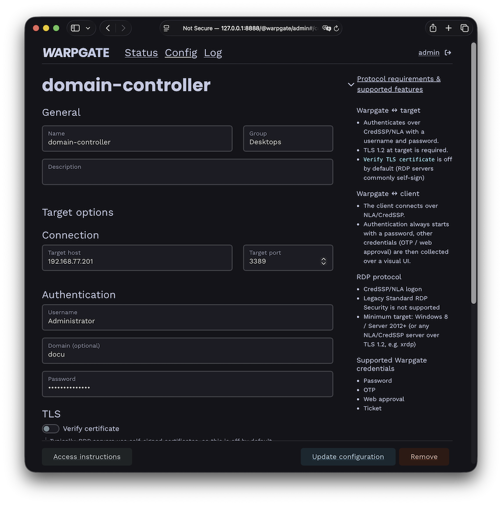
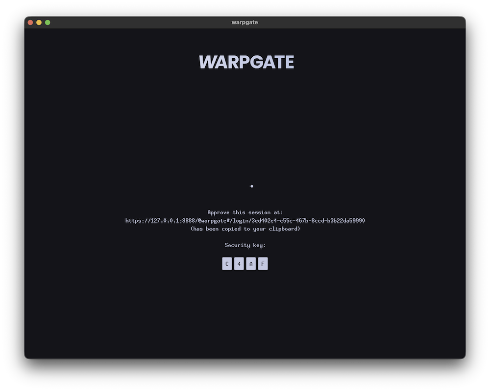

# Adding RDP targets

<div class="badge font-xs text-bg-warning mb-3">v0.27+</div>

Warpgate can proxy Microsoft **RDP** (Remote Desktop) connections, giving them the same authentication, access control and session recording as the other protocols. Users connect with a standard RDP client (mstsc.exe, FreeRDP, Remmina, …) or open the desktop **directly in their browser**.

## How it works

Warpgate terminates the viewer's RDP connection and authenticates the user with their Warpgate credentials, then opens a fresh connection to the upstream host over TLS + CredSSP (NLA), logging in with the credentials you configured on the target. The entire session can be recorded, including user inputs.

## Enabling the RDP listener

Enable the RDP protocol in your config file (default: `/etc/warpgate.yaml`) if you didn't do so during the initial setup:

```diff
+ rdp:
+   enable: true
+   listen: '[::]:3389'
+   certificate: /var/lib/warpgate/tls.certificate.pem
+   key: /var/lib/warpgate/tls.key.pem
```

You can reuse the same certificate and key that are used for the HTTP listener.

## Connection setup

Log into the Warpgate admin UI, navigate to `Config` > `Targets` > `Add target`, select **RDP** and give the new target a name.

Fill out the connection and authentication info:


/// caption
RDP target configuration
///

!!! note
    Most RDP servers use a self-signed certificate, which is why verification is turned off by default.

### Additional options

* **Interactive logon** (v0.29+) - Warpgate will ask the remote OS to display a login screen, forcing the user to log in again. The credentials you've previously specified are then only used for the connection itself.
* **Compression between Warpgate and target** (v0.28.5+) - `RemoteFX` (default) or `Lossless`. If Warpgate has fast connection to the target, you should choose `Lossless` to avoid image quality loss through double compression.

The target shows up on the Warpgate homepage for users allowed to access it.

## Client setup

Users can connect in two ways.

### In the browser

Clicking the target opens a web-based desktop client in a new tab — no local RDP client required:


/// caption
In-browser RDP desktop
///

The in-browser desktop can be turned off globally under `Config` > `Global parameters`, leaving users with connection instructions only.

### With a native RDP client

Point an RDP client (mstsc, FreeRDP, Remmina, …) at:

* Host: the Warpgate host
* Port: the Warpgate RDP port (default: 3389)
* Username: `<user>:<target-name>` (for example `admin:vm1`)
* Password: user's Warpgate password

Warpgate authenticates the viewer over NLA/CredSSP. If the account requires a second factor, Warpgate shows a holding screen inside the RDP session:


/// caption
Collecting a second factor during RDP login
///

Once authenticated, Warpgate connects to the target and the desktop appears.

!!! note
    The target connection always uses TLS + CredSSP/NLA. By default Warpgate requires TLS 1.2 (Windows 10 / Server 2016 or newer, or any NLA/CredSSP server such as xrdp); for older hosts, pick a different **Security level** in the target's TLS settings (TLS 1.2 with legacy ciphers for Windows 8 / Server 2012, or TLS 1.0 for Windows Server 2008 R2 and older).

## Session recording

When session recording is enabled, RDP sessions are recorded as video and can be replayed from the Admin UI. Keyboard input recording can be disabled under `Config` > `Global parameters` > `Session recordings` (v0.29+) if capturing passwords is a concern.

### Up next

* [Adding VNC targets](./vnc.md)
* [User authentication](../auth.md)
