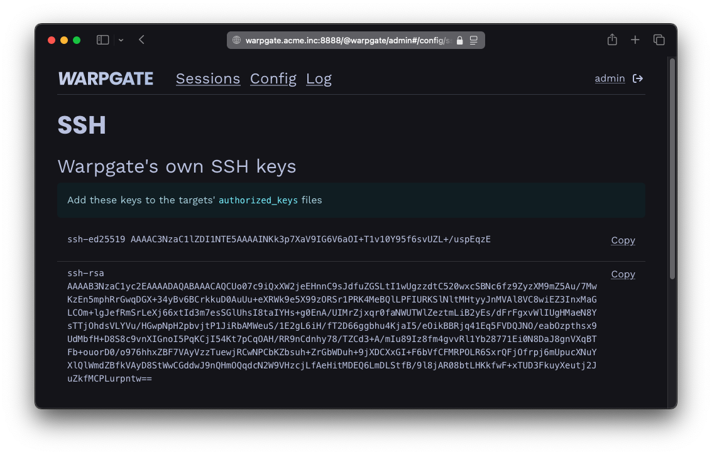
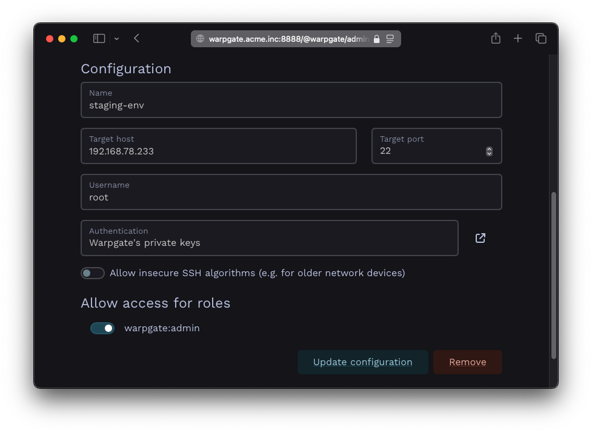
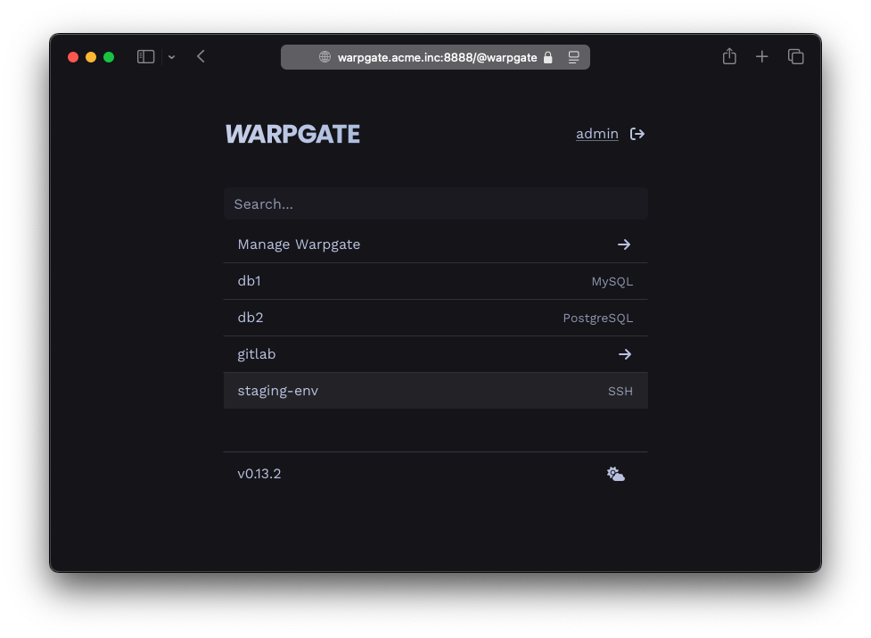
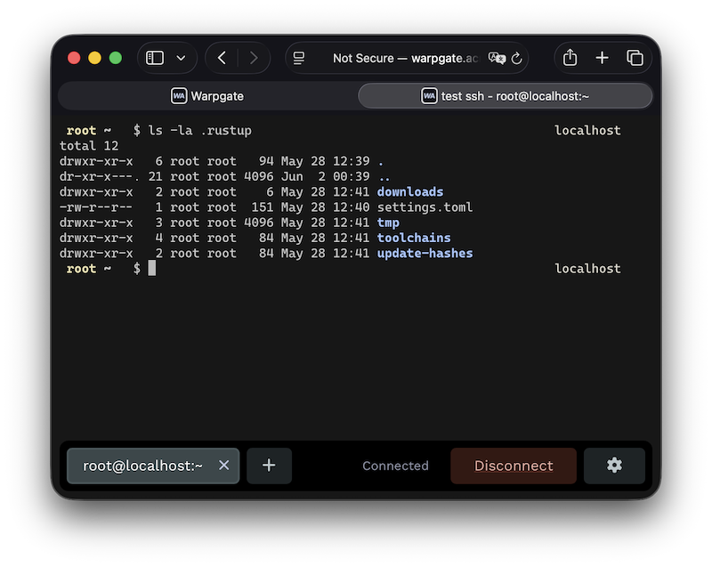
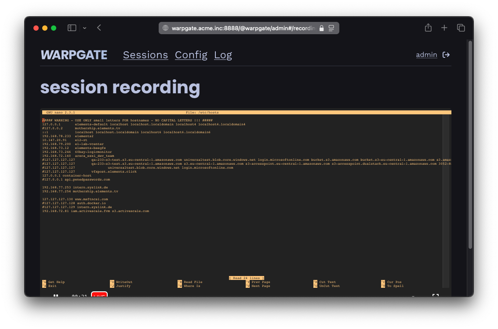

# Adding SSH targets

## Authentication setup

### Preferred: public-key auth

Warpgate has its own set of SSH keys which the target host must trust in order for connections to work.

The keys are stored in Warpgate's database and shared across all nodes of a cluster, so you never need to copy them between nodes by hand. On a fresh install Warpgate generates an Ed25519 and an RSA key automatically. Any keys found in the legacy on-disk location are imported into the database once, on first startup.

Manage the keys on the `Config` -> `SSH keys` page of the Admin UI:


/// caption
Warpgate's public keys
///

<div class="badge font-xs text-bg-warning mb-3">v0.27+</div>

* **Generate** a new Ed25519 or RSA key,
* **Import** an existing private key (OpenSSH or PKCS#8 PEM format, without a passphrase),
* **rename** a key,
* mark one or more keys as **default**,
* **delete** any key, except the last remaining one.

*Default* keys are the ones offered to a target that doesn't select a specific key (see [Choosing a key per target](#choosing-a-key-per-target) below).

You can also list the public keys with the `warpgate client-keys` CLI command:

```
$ warpgate client-keys
13:59:41  INFO Using config: "/etc/warpgate.yaml" (users: 1, targets: 2, roles: 1)
Warpgate SSH client keys:
(add these to your target's authorized_keys file)

ssh-ed25519 AAAAC3NzaC1lZDI1NTE[...]aM+3RBsT5 client-ed25519 (default)
rsa-sha2-256 AAAADHJzYS[...] client-rsa (default)
```

Copy one of them and paste it at the end of the `~/.ssh/authorized_keys` file on the target host (each target host OS user has their own `authorized_keys` file and you will need to create it if it doesn't exist yet).

#### Choosing a key per target

<div class="badge font-xs text-bg-warning mb-3">v0.27+</div>

An SSH target using public-key authentication is offered every *default* key by default. When editing the target, you can instead pick a **specific key** from the drop-down — useful when a host trusts only one particular key. If that key is later deleted, the target falls back to the default keys.

### Alternative: password authentication

Although not recommended, you can use a password to authenticate against a target instead.

### Alternative: AWS EC2 Instance Connect

<div class="badge font-xs text-bg-warning mb-3">v0.22+</div>

If Warpgate runs on an EC2 instance, it can authenticate to EC2 SSH targets using **EC2 Instance Connect** — no key or password is stored on the target. Select **IAM Role** as the target's authentication method (this option only appears when Warpgate detects it is running on EC2).

When a user connects, Warpgate looks up the EC2 instance by its IP address, pushes its managed public key to the instance via EC2 Instance Connect, and authenticates with it. The target `username` is used as the instance OS user (e.g. `ec2-user`).

Warpgate's IAM role needs `ec2:DescribeRegions`, `ec2:DescribeInstances` and `ec2-instance-connect:SendSSHPublicKey`.

## Connection setup

Log into the Warpgate admin UI and navigate to `Config` > `Targets` > `Add target` and give the new target a name:


/// caption
Adding an SSH target
///

Fill out the connection and authentication info and click `Update configuration`, for example:


/// caption
SSH target configuration
///

The target should show up on the Warpgate homepage for users that are allowed to access it:


/// caption
SSH target on the start page
///

Users will be able to click the entry to connect to it directly via a web-based terminal (v0.24+) and/or obtain connection instructions for their own SSH client:


/// caption
Web-based SSH terminal
///


/// caption
SSH connection instructions
///

The web-based terminal can be turned off globally (v0.26+) under `Config` > `Global parameters` > `Web SSH`, leaving users with connection instructions only.

## Client setup

Now, fire up your favorite SSH client and try connecting to Warpgate:

* Host: the Warpgate host
* Port: the Warpgate SSH port (default: 2222)
* Username: `admin:<target-name>`, in this example: `admin:vm1`
* Password: your Warpgate admin password

When connecting for the first time, Warpgate will ask you to check and confirm the target host's SSH host key fingerprint (which you really should do).

Here's what it looks like with OpenSSH:

```
$ ssh c.wilde:staging-env@warpgate.acme.inc
c.wilde:staging-env@warpgate.acme.inc's password:

 Warpgate  Selected target: staging-env
 Warpgate  Host key (ssh-ed25519): AAAAC3[...]
 Warpgate  There is no trusted ssh-ed25519 key for this host.
 Warpgate  Trust this key? (y/n)

 ✓ Warpgate connected

 root ~   $
```

From this point on, you can use this as a normal SSH connection, including SFTP etc.

While your SSH session is running, you'll be able to see its status in the Admin UI:


/// caption
SSH session log
///

Click the shell session entry in the `Recordings` section for a live view and replay of the terminal session:


/// caption
SSH session recording
///

## Shell command auditing

<div class="badge font-xs text-bg-warning mb-3">v0.27+</div>

For interactive shell sessions, Warpgate will try to record the commands a user types as separate log entries for auditing. Detected commands appear tagged with `Shell command` entries in the session log.

This is a **heuristic audit aid, not a security boundary**: it is impossible to prevent a user from purposedly obscuring their inputs in an unlimited shell.

## Connecting to legacy servers

By default Warpgate only offers modern, secure key-exchange and encryption algorithms. To reach an older device that only supports legacy algorithms (DH groups 1/14, 3DES, HMAC-SHA1 or RSA-SHA1), enable **Allow insecure algorithms**.

### Up next

* [User authentication](../auth.md)
