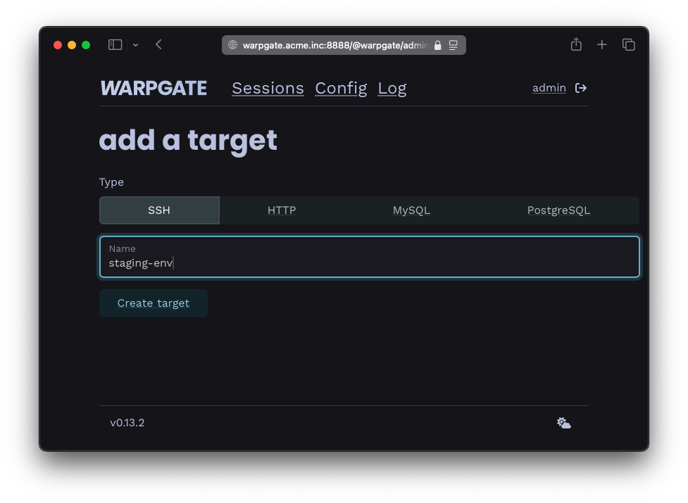

# Adding SSH targets

## Authentication setup

### Preferred: public-key auth

Warpgate has its own set of SSH keys which the target host must trust in order for connections to work.

You can view these keys on the `Config` -> `SSH keys` page of the Admin UI, or via the `warpgate client-keys` CLI command:


/// caption
Warpgate's public keys
///


```
$ warpgate client-keys
13:59:41  INFO Using config: "/etc/warpgate.yaml" (users: 1, targets: 2, roles: 1)
Warpgate SSH client keys:
(add these to your target's authorized_keys file)

ssh-ed25519 AAAAC3NzaC1lZDI1NTE[...]aM+3RBsT5
rsa-sha2-256 AAAADHJzYS[...]
```

The keys are listed in the order of preference. Copy one of them and paste it at the end of the `~/.ssh/authorized_keys` file on the other side (each target host OS' user has their own `authorized_keys` file and you will need to create it if it doesn't exist yet).

### Alternative: password authentication

Although not recommended, you can use a password to authenticate against a target instead.

## Connection setup

Log into the Warpgate admin UI and navigate to `Config` > `Targets` > `Add target` and give the new target a name:


/// caption
Adding an SSH target
///

Fill out the connection and authentication info and click `Update configuration`, for example:


/// caption
SSH target configuration
///

The target should show up on the Warpgate homepage for users that are allowed to access it:


/// caption
SSH target on the start page
///

Users will be able to click the entry to obtain connection instructions:


/// caption
SSH connection instructions
///

## Client setup

Now, fire up your favorite SSH client and try connecting to Warpgate:

* Host: the Warpgate host
* Port: the Warpgate SSH port (default: 2222)
* Username: `admin:<target-name>`, in this example: `admin:vm1`
* Password: your Warpgate admin password

When connecting for the first time, Warpgate will ask you to check and confirm the target host's SSH host key fingerprint (which you really should do).

Here's what it looks like with OpenSSH:

```
$ ssh admin:vm1@192.168.77.253 -p 2222
admin:vm1@192.168.77.253's password:

 Warpgate  Selected target: vm1
 Warpgate  Host key (ssh-ed25519): AAAAC3[...]
 Warpgate  There is no trusted ssh-ed25519 key for this host.
 Warpgate  Trust this key? (y/n)

 ✓ Warpgate connected

 root ~   $
```

From this point on, you can use this as a normal SSH connection, including SFTP etc.

While your SSH session is running, you'll be able to see its status in the Admin UI:


/// caption
SSH session log
///

Click the shell session entry in the `Recordings` section for a live view and replay of the terminal session:


/// caption
SSH session recording
///

### Up next

* [User authentication and roles](../auth-and-roles.md)
