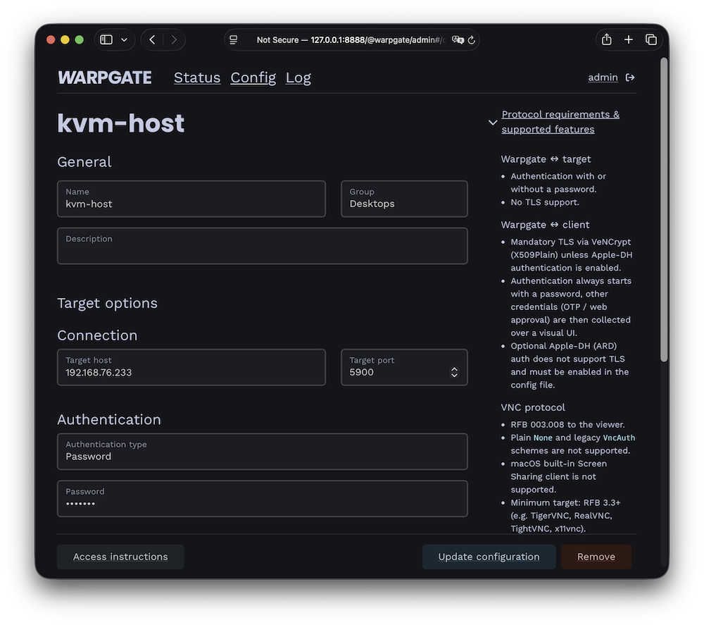
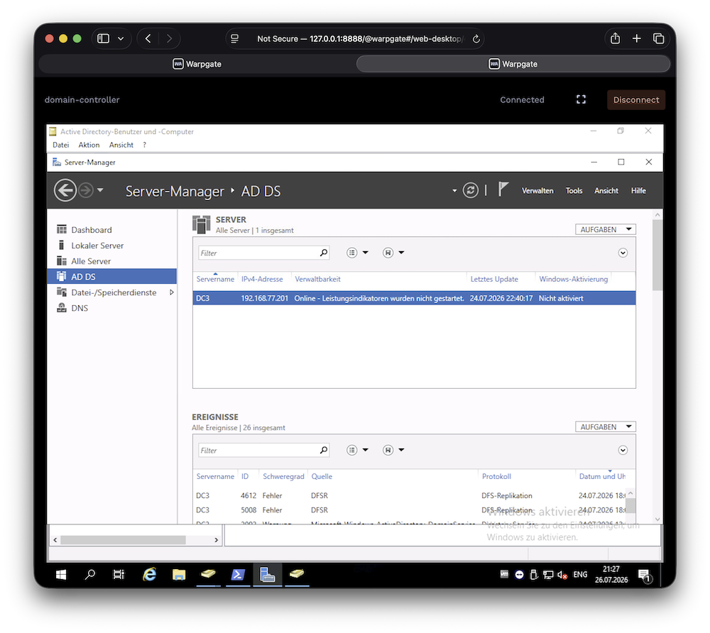

# Adding VNC targets

<div class="badge font-xs text-bg-warning mb-3">v0.27+</div>

Warpgate can proxy **VNC** (RFB) connections with the same authentication, access control and session recording as the other protocols. Users connect with a standard VNC viewer or open the desktop **directly in their browser**.

## How it works

Warpgate terminates the viewer's VNC connection over TLS (VeNCrypt) and authenticates the user with their Warpgate credentials, then connects to the upstream VNC server, sending the VNC password you configured on the target (if any). The session can be recorded.

## Enabling the VNC listener

Enable the VNC protocol in your config file (default: `/etc/warpgate.yaml`):

```diff
+ vnc:
+   enable: true
+   listen: '[::]:5900'
+   certificate: /var/lib/warpgate/tls.certificate.pem
+   key: /var/lib/warpgate/tls.key.pem
```

You can reuse the same certificate and key that are used for the HTTP listener.

!!! warning
    `enable_ard_auth: true` additionally enables Apple-DH (ARD) authentication, which is **not** protected by TLS. Leave it off unless you specifically need ARD clients.

## Connection setup

Log into the Warpgate admin UI, navigate to `Config` > `Targets` > `Add target`, select **VNC** and give the new target a name. Fill out the configuration:


/// caption
VNC target configuration
///

The target shows up on the Warpgate homepage for users who are allowed to access it.

## Client setup

Users can connect in two ways:

### In the browser

Clicking the target opens a web-based desktop client in a new tab — no local VNC viewer required:


/// caption
In-browser VNC desktop
///

The in-browser desktop can be turned off globally under `Config` > `Global parameters`, leaving users with connection instructions only.

### With a native VNC viewer

Your viewer must support **VeNCrypt (X509Plain)**. Connect to:

* Host: the Warpgate host
* Port: the Warpgate VNC port (default: 5900)
* Username: `<user>:<target-name>` (for example `admin:vm1`)
* Password: user's Warpgate password

A second factor (one-time password or in-browser approval) is collected on a holding screen inside the VNC session.

## Session recording

When session recording is enabled, VNC sessions are recorded and can be replayed from the Admin UI.

### Up next

* [User authentication](../auth.md)
