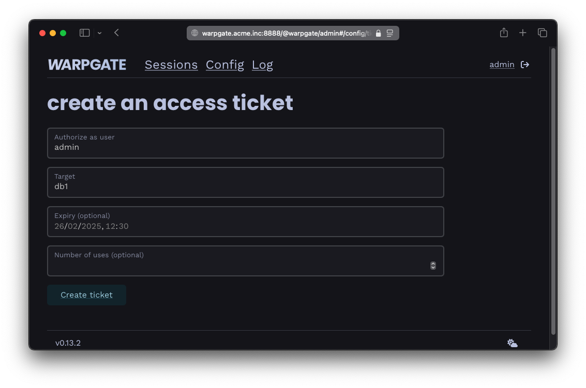
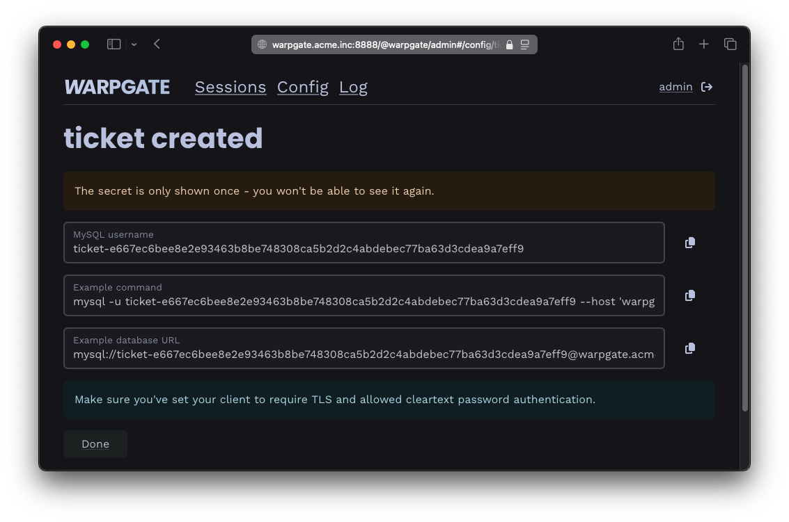

# Access tickets

You can issue tickets that grant a specific user access to a specific target, bypassing authorization. This is especially useful for non-interactive sessions where 2FA flows aren't possible, e.g. when connecting an application to a database or an API through Warpgate.

A ticket can optionally expire at a set time and/or after a number of uses.

## Creating a ticket

In the admin UI, create a ticket in the `Config` -> `Tickets` section, selecting a user account and a target:

/// caption
Creating a ticket
///

Once the ticket is created, you'll see the protocol-specific connection instructions. In this example, for a MySQL database, the ticket is passed as a part of the connection string / `DATABASE_URL`:

/// caption
Ticket connection instructions
///

## Self-service ticket requests

v0.24+

Users can also request time-limited tickets from an admin user. Enable this under `Config` > `Global parameters` > `Tickets` > `Allow users to request tickets`. Users then get a `Ticket requests` page in their profile menu, where can send a request for a specific ticket configuration.

Pending requests show up under `Status` > `Requests` in the admin UI, where an admin can approve or deny them.

### Up next

* [Session approvals](./approvals.md)
