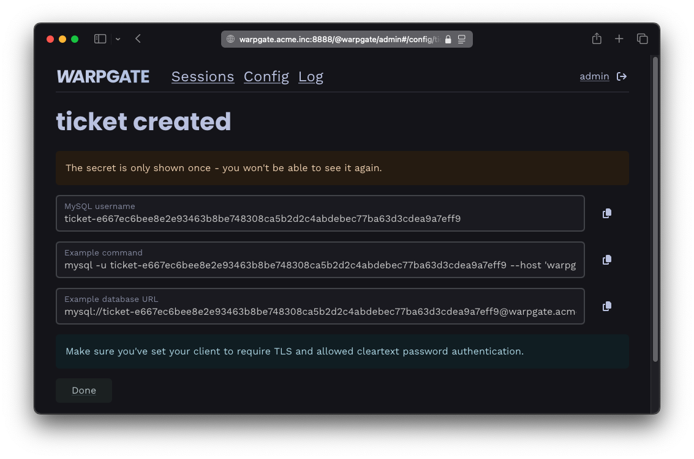

# Access tickets

You can issue tickets that grant a specific user access to a specific target, bypassing authorization. This is especially useful for non-interactive sessions where 2FA flows aren't possible, e.g. when connecting an application to a database or an API through Warpgate.

## Creating a ticket

In the admin UI, create a ticket in the `Config` -> `Tickets` section, selecting a user account and a target:

/// caption
Creating a ticket
///

Once the ticket is created, you'll see the protocol-specific connection instructions. In this example, for an MySQL database, the ticket is passed as a part of the connection string / `DATABASE_URL`:

/// caption
Ticket connection instructions
///
